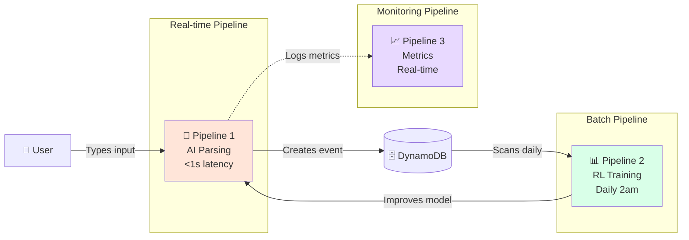
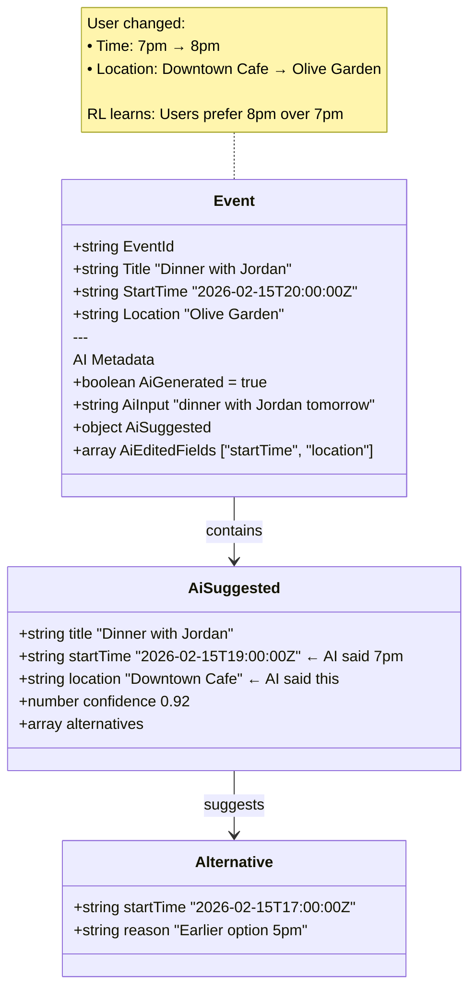
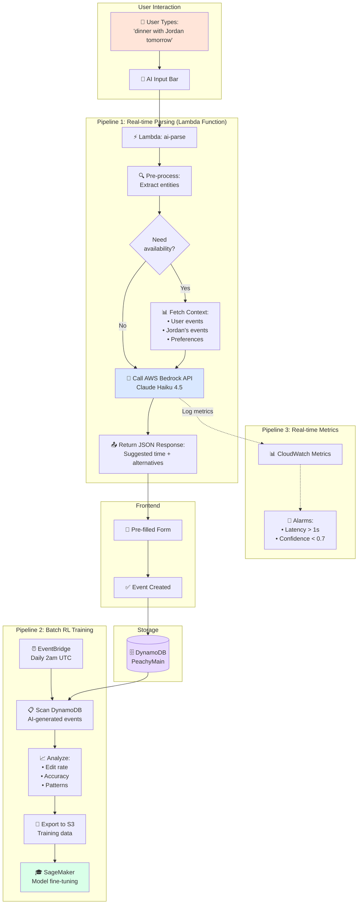
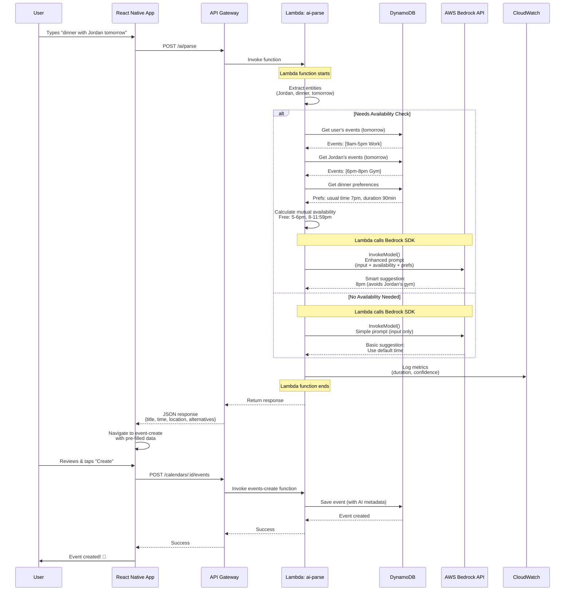
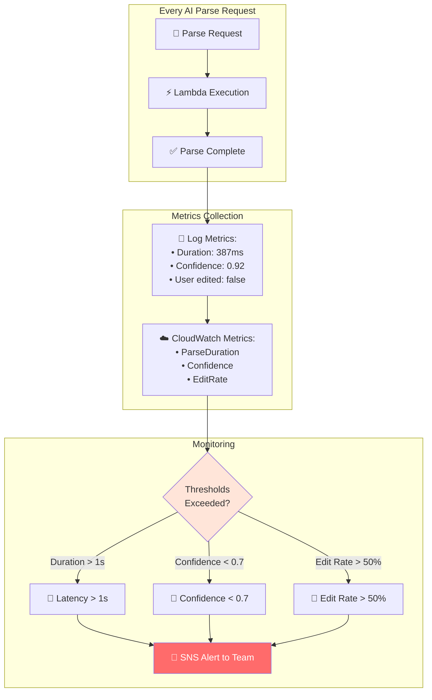
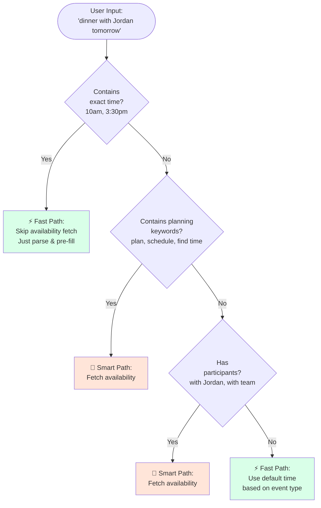
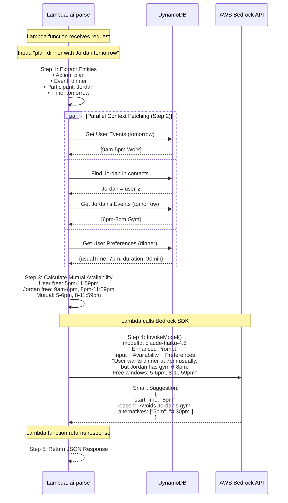

# AI Event Creation Data Pipeline

## Tech Stack

| Component | Technology | Purpose |
|-----------|-----------|---------|
| **Frontend** | React Native (Expo) | User input & form pre-fill |
| **API** | AWS API Gateway + Lambda (Node.js) | REST endpoints |
| **AI** | AWS Bedrock (Claude Haiku 4.5 / Sonnet 4.5) | NLP parsing |
| **Database** | DynamoDB | Event storage |
| **RL Framework** | AWS SageMaker (future) | Model fine-tuning |

---

## Visual Pipeline Diagrams

> **Note:** AWS Bedrock is not a separate service/endpoint. The Lambda function (`ai-parse`) calls AWS Bedrock API via the AWS SDK (`@aws-sdk/client-bedrock-runtime`). The diagrams show Bedrock separately for clarity, but in reality, it's an API call made from within the Lambda function.

**Lambda Function Flow:**
```
Lambda: ai-parse
  ├─ Extract entities from user input
  ├─ Fetch context from DynamoDB (if needed)
  ├─ Build enhanced prompt
  ├─ Call AWS Bedrock API: bedrockClient.send(InvokeModelCommand)  ← SDK call
  └─ Return parsed result
```

---

### Overview: Three Pipelines Working Together



---

### AI Event Storage with ML Metadata



---

### Complete AI Pipeline Architecture



---

### Pipeline 1: Real-time Event Creation (Detailed)



---

## Pipeline Overview

### Pipeline 1: Real-time Event Creation (User-triggered)

**When:** User types natural language → creates event
**Latency:** <1 second end-to-end

```
┌──────────────────────────────────────────────────────────────────┐
│              REAL-TIME PIPELINE (with Context Fetching)           │
└──────────────────────────────────────────────────────────────────┘

   User Input            Lambda Pre-processing         Database
   ─────────────────────────────────────────────────────────────────

   "dinner with      →   1. Parse input        →   Fetch context:
   Jordan tomorrow"      2. Extract entities        ────────────
                            - "Jordan" = user       • Jordan's
                            - "dinner" = meal         availability
                            - "tomorrow"            • User's own
                                                      availability
                                                    • Past dinner
                                                      preferences

   ─────────────────────────────────────────────────────────────────
                              ↓
                         Build AI Prompt
                         ────────────────
                         Input + Availability
                         + User preferences
                              ↓
   ─────────────────────────────────────────────────────────────────

   AI Processing         AWS Bedrock               Smart Suggestion
   ─────────────────────────────────────────────────────────────────

                    →   Claude Haiku 4.5     →   { title: "Dinner",
                        + Context                  startTime: "7pm"
                        ~300ms                     (avoids conflicts!)
                                                   invitees: ["user-2"]
                                                   suggestedTimes: [
                                                     "6pm (available)",
                                                     "8pm (available)"
                                                   ] }

   ─────────────────────────────────────────────────────────────────
                              ↓
   ─────────────────────────────────────────────────────────────────

   Pre-filled Form   ←   Navigate with      ←  Return JSON
   (with smart           URL params             + Availability
   suggestions)                                 warnings

   ─────────────────────────────────────────────────────────────────
                              ↓
                         User taps
                         "Create Event"
                              ↓
   ─────────────────────────────────────────────────────────────────

   Event Saved       ←   POST /events       →   DynamoDB
   (with AI metadata)    (Lambda)                PeachyMain
                                                  + Atomic writes
```

### Pipeline 2: Batch RL Training (Scheduled)

**When:** Daily at 2am UTC
**Purpose:** Improve AI accuracy from user feedback

```
┌──────────────────────────────────────────────────────────────────┐
│                    BATCH PIPELINE (Daily)                         │
└──────────────────────────────────────────────────────────────────┘

   EventBridge              Lambda                  Analytics
   ─────────────────────────────────────────────────────────────────

   Cron: 0 2 * * *   →   Scan DynamoDB     →   Extract Features
   (Daily 2am)           (AI-generated           ────────────────
                         events only)            aiInput
                                                 aiEditedFields
                                                 Final event data

   ─────────────────────────────────────────────────────────────────
                              ↓
                         Aggregate Stats
                         ────────────────
                         • Edit rate by field
                         • Common patterns
                         • Confidence vs accuracy
                              ↓
   ─────────────────────────────────────────────────────────────────

   Model Update      ←   SageMaker         ←   Training Data
   (if needed)           Fine-tuning            (S3 bucket)
                         Pipeline
```

### Pipeline 3: Real-time Metrics (Per request)

**When:** Every AI parse request
**Purpose:** Monitor performance

```
┌──────────────────────────────────────────────────────────────────┐
│                    METRICS PIPELINE                               │
└──────────────────────────────────────────────────────────────────┘

   Lambda                  CloudWatch              Alarms
   ─────────────────────────────────────────────────────────────────

   Parse completes   →   Log Metrics        →   Alert if:
   ────────────────      ────────────           ────────────
   • Duration            • ParseDuration        • >1s latency
   • Confidence          • Confidence           • <0.7 confidence
   • User edits          • EditRate             • >50% edit rate
```

---

## Context Fetching Workflow

### Step 1: Extract Entities from Input

**Input:** `"plan dinner with Jordan tomorrow"`

**Lambda Pre-processing:**
```typescript
function extractEntities(input: string) {
  return {
    action: 'plan',              // or 'schedule', 'create'
    eventType: 'dinner',         // triggers meal preferences
    participants: ['Jordan'],     // triggers availability fetch
    timeframe: 'tomorrow',       // defines search window
    needsAvailability: true      // triggers availability check
  };
}
```

### Step 2: Fetch Availability Data

**Query DynamoDB for conflicts:**
```typescript
// 1. Identify Jordan from contacts
const jordan = contacts.find(c => c.name.includes('Jordan'));

// 2. Get tomorrow's date range
const tomorrow = getTomorrowDateRange(); // 00:00 - 23:59

// 3. Query Jordan's events (parallel fetch)
const [userEvents, jordanEvents, preferences] = await Promise.all([
  getEventsForDateRange(userId, tomorrow),
  getEventsForDateRange(jordan.id, tomorrow),
  getUserPreferences(userId, 'dinner')
]);
```

**Availability Schema:**
```json
{
  "date": "2026-02-15",
  "userAvailability": [
    { "start": "09:00", "end": "17:00", "status": "busy", "event": "Work" },
    { "start": "17:00", "end": "23:59", "status": "free" }
  ],
  "jordanAvailability": [
    { "start": "09:00", "end": "12:00", "status": "busy", "event": "Meeting" },
    { "start": "12:00", "end": "18:00", "status": "free" },
    { "start": "18:00", "end": "20:00", "status": "busy", "event": "Gym" },
    { "start": "20:00", "end": "23:59", "status": "free" }
  ],
  "mutuallyFree": [
    { "start": "17:00", "end": "18:00" },
    { "start": "20:00", "end": "23:59" }
  ],
  "userPreferences": {
    "dinnerTime": "19:00",        // User usually has dinner at 7pm
    "dinnerDuration": 90,         // 1.5 hours average
    "favoriteRestaurants": ["Downtown Cafe", "Olive Garden"]
  }
}
```

### Step 3: Enhanced AI Prompt with Context

```typescript
const enhancedPrompt = `Parse this natural language input and suggest the BEST time based on availability.

User Input: "${inputText}"

Context:
- User timezone: America/Los_Angeles
- Current time: 2026-02-14T10:30:00Z
- User's contacts: Jordan Lee (@jordanlee), Taylor Smith (@taylorsmith)

AVAILABILITY DATA (IMPORTANT):
User (tomorrow):
- Busy: 9am-5pm (Work)
- Free: 5pm-11:59pm

Jordan (tomorrow):
- Busy: 9am-12pm (Meeting), 6pm-8pm (Gym)
- Free: 12pm-6pm, 8pm-11:59pm

Mutually free windows:
- 5pm-6pm (1 hour)
- 8pm-11:59pm (4 hours)

User Preferences:
- Usually has dinner at 7pm
- Average dinner duration: 1.5 hours
- Favorite restaurants: Downtown Cafe, Olive Garden

TASK:
1. Suggest a start time that:
   - Falls within mutually free windows
   - Is close to user's usual dinner time (7pm)
   - Allows enough time for meal duration (1.5h)

2. If user's preferred time (7pm) has conflicts, suggest alternatives

3. Include location hint if user has preferences

Return JSON with suggested time + alternative options.`;
```

**AI Response with Smart Suggestions:**
```json
{
  "extractedData": {
    "title": "Dinner with Jordan",
    "startTime": "2026-02-15T20:00:00Z",
    "endTime": "2026-02-15T21:30:00Z",
    "location": "Downtown Cafe",
    "invitedUserIds": ["user-2"],
    "reasoning": "8pm chosen because 7pm conflicts with Jordan's gym (6-8pm)"
  },
  "alternatives": [
    {
      "startTime": "2026-02-15T17:00:00Z",
      "reason": "Earlier option (5pm), both free but before usual dinner time"
    },
    {
      "startTime": "2026-02-15T20:30:00Z",
      "reason": "Later option (8:30pm), also conflict-free"
    }
  ],
  "conflicts": [
    {
      "time": "19:00",
      "conflict": "Jordan has gym session 6-8pm"
    }
  ],
  "confidence": 0.95
}
```

---

## Data Schemas

### Input Schema: User → API

**Request: `POST /ai/parse`**
```json
{
  "inputText": "dinner with Jordan tomorrow at 7pm"
}
```

**Response: API → Frontend**
```json
{
  "parseId": "parse-uuid-123",
  "extractedData": {
    "title": "Dinner with Jordan",
    "startTime": "2026-02-15T19:00:00Z",
    "endTime": "2026-02-15T21:00:00Z",
    "isAllDay": false,
    "location": null,
    "invitedUserIds": ["user-2"]
  },
  "confidence": 0.92,
  "ambiguities": [],
  "processingTimeMs": 387
}
```

### Storage Schema: Event in DynamoDB

**Table: `PeachyMain`**
```json
{
  "PK": "CALENDAR#cal-1",
  "SK": "EVENT#2026-02-15T19:00:00Z#event-123",
  "GSI1PK": "EVENT#event-123",
  "GSI1SK": "METADATA",

  "EntityType": "EVENT",
  "EventId": "event-123",
  "CalendarId": "cal-1",
  "Title": "Dinner with Jordan",
  "StartTime": "2026-02-15T19:00:00Z",
  "EndTime": "2026-02-15T21:00:00Z",
  "Location": "Downtown Restaurant",
  "InvitedUserIds": ["user-2"],
  "CreatedBy": "user-1",

  "AiGenerated": true,
  "AiInput": "dinner with Jordan tomorrow at 7pm",
  "AiEditedFields": ["location"],

  "CreatedAt": "2026-02-14T10:30:00Z",
  "UpdatedAt": "2026-02-14T10:30:00Z"
}
```

### RL Training Schema

**Training Data Export (Daily)**
```json
{
  "timestamp": "2026-02-14T02:00:00Z",
  "eventCount": 1247,
  "samples": [
    {
      "aiInput": "dinner with Jordan tomorrow at 7pm",
      "aiExtracted": {
        "title": "Dinner",
        "startTime": "2026-02-15T19:00:00Z",
        "location": null
      },
      "userFinal": {
        "title": "Dinner with Jordan",
        "startTime": "2026-02-15T19:00:00Z",
        "location": "Downtown Restaurant"
      },
      "editedFields": ["title", "location"],
      "outcome": "accepted"
    }
  ],
  "stats": {
    "totalAiEvents": 1247,
    "editRate": 0.34,
    "mostEditedFields": {
      "title": 289,
      "location": 187,
      "startTime": 95
    }
  }
}
```

---

## Use Cases & Triggers

### Use Case 1: Simple Parsing (No availability check)
**Trigger:** User specifies exact time
**Pipeline:** Real-time (Pipeline 1) - Skip availability fetch
**SLA:** <500ms (faster - no DB queries)
**Example:**
```
Input:  "coffee with Taylor tomorrow 10am"
AI:     { title: "Coffee with Taylor", time: "10:00" }
Output: Pre-filled form (user didn't ask for suggestions)
```

### Use Case 2: Smart Scheduling (Availability-aware)
**Trigger:** User asks to "plan" or doesn't specify time
**Pipeline:** Real-time (Pipeline 1) - WITH availability fetch
**SLA:** <1 second (includes DB queries)
**Example:**
```
Input:  "plan dinner with Jordan tomorrow"

Lambda Pre-processing:
→ Detect "plan" keyword (needs suggestions)
→ Fetch Jordan's availability for tomorrow
→ Fetch user's availability for tomorrow
→ Fetch user's dinner preferences

AI Processing:
→ Receives availability data in prompt
→ Suggests 8pm (avoids Jordan's 6-8pm gym conflict)
→ Provides alternatives: 5pm, 8:30pm

Output: Pre-filled form with smart time + alternatives shown
```

### Use Case 3: Model Improvement (RL)
**Trigger:** Scheduled (daily 2am UTC)
**Pipeline:** Batch RL (Pipeline 2)
**SLA:** Complete within 1 hour
**Example:**
```
Analyze: 1,247 AI-generated events from yesterday
Find:    AI suggested 7pm, user changed to 8pm (23% of cases)
Insight: Users prefer 8pm over 7pm for dinner
Action:  Update prompt to default dinner to 8pm instead of 7pm
```

### Use Case 4: Performance Monitoring
**Trigger:** Every API request
**Pipeline:** Metrics (Pipeline 3)
**SLA:** Real-time
**Example:**
```
Detect: Availability fetch taking >300ms
Alert:  DynamoDB query slow (needs index optimization)
Action: Add GSI3 for date-range queries
```

---

### Pipeline 2: Batch RL Training (Visual)

```mermaid
flowchart LR
    subgraph "Trigger"
        CRON[⏰ EventBridge Cron<br/>Daily 2am UTC]
    end

    subgraph "Data Collection"
        SCAN[📋 Scan DynamoDB<br/>Filter: AiGenerated = true]
        EXTRACT[🔍 Extract Features:<br/>• aiInput<br/>• aiSuggested<br/>• Final event data<br/>• aiEditedFields]
    end

    subgraph "Analysis"
        CALC[📊 Calculate Metrics:<br/>• Accuracy by field<br/>• Edit rate<br/>• Time error magnitude<br/>• Common patterns]
        AGG[📈 Aggregate:<br/>• Total events: 1247<br/>• Title accuracy: 95%<br/>• Time accuracy: 65%<br/>• Location accuracy: 40%]
    end

    subgraph "Training"
        EXPORT[💾 Export to S3:<br/>s3://peachy-ml-training/<br/>events/2026-02-15.json]
        SAGE[🎓 SageMaker:<br/>Fine-tune model<br/>if accuracy drops]
        UPDATE[🔄 Update Prompt:<br/>Apply learnings<br/>to production]
    end

    CRON --> SCAN
    SCAN --> EXTRACT
    EXTRACT --> CALC
    CALC --> AGG
    AGG --> EXPORT
    EXPORT --> SAGE
    SAGE --> UPDATE

    style CRON fill:#FFE5D9
    style SAGE fill:#D9FFE8
    style UPDATE fill:#E8D9FF
```



---

### Pipeline 3: Real-time Metrics (Visual)



---

## Decision Tree: When to Fetch Availability



**ASCII Version (for reference):**

```
User Input
    ↓
    ├─ Contains exact time? (e.g., "10am", "3:30pm")
    │  → YES → Skip availability fetch (fast path)
    │           Just parse and pre-fill form
    │
    └─ NO → Check for planning keywords
             ↓
             ├─ Contains "plan", "schedule", "find time", "when's good"?
             │  → YES → Fetch availability (smart path)
             │
             └─ Has participants? (e.g., "with Jordan")
                │  → YES → Fetch availability (smart path)
                │
                └─ NO → Basic parsing (fast path)
                        Use default time based on event type
```

**Examples:**

| Input | Path | Availability Fetch? | Reason |
|-------|------|---------------------|---------|
| "coffee with Taylor 10am tomorrow" | Fast | ❌ No | Exact time specified |
| "plan dinner with Jordan tomorrow" | Smart | ✅ Yes | "plan" keyword + participant |
| "meeting with team next week" | Smart | ✅ Yes | Participant (team) + vague time |
| "lunch at noon" | Fast | ❌ No | Exact time ("noon" = 12pm) |
| "find time for 1-on-1 with Taylor" | Smart | ✅ Yes | "find time" keyword |
| "workout tomorrow" | Fast | ❌ No | No participants (solo event) |

---

## Technology Stack Details

### Lambda: Availability Fetching Logic

```typescript
export async function parseWithContext(userId: string, inputText: string) {
  // Step 1: Decide if we need availability
  const needsAvailability = shouldFetchAvailability(inputText);

  if (!needsAvailability) {
    // Fast path: Skip availability fetch
    return await simpleAIParse(userId, inputText);
  }

  // Step 2: Extract entities
  const entities = extractEntities(inputText);
  const participants = await resolveParticipants(userId, entities.participants);
  const dateRange = parseDateRange(entities.timeframe);

  // Step 3: Fetch availability (parallel queries)
  const [userEvents, participantEvents, preferences] = await Promise.all([
    getEventsForDateRange(userId, dateRange),
    Promise.all(participants.map(p => getEventsForDateRange(p.id, dateRange))),
    getUserPreferences(userId, entities.eventType)
  ]);

  // Step 4: Calculate mutual availability
  const availability = calculateMutualAvailability(
    userEvents,
    participantEvents.flat(),
    dateRange
  );

  // Step 5: Call AI with enriched context
  return await smartAIParse(userId, inputText, {
    participants,
    availability,
    preferences
  });
}

function shouldFetchAvailability(input: string): boolean {
  const keywords = ['plan', 'schedule', 'find time', 'when', 'available'];
  const hasKeyword = keywords.some(k => input.toLowerCase().includes(k));

  const hasExactTime = /\d{1,2}(:\d{2})?\s*(am|pm)/i.test(input);

  // Fetch if has planning keywords OR no exact time specified
  return hasKeyword || !hasExactTime;
}

function calculateMutualAvailability(
  userEvents: Event[],
  participantEvents: Event[],
  dateRange: { start: Date; end: Date }
) {
  // Convert events to busy blocks
  const allBusyBlocks = [...userEvents, ...participantEvents].map(e => ({
    start: new Date(e.startTime),
    end: new Date(e.endTime)
  }));

  // Find free windows
  const freeWindows = [];
  let currentTime = dateRange.start;

  while (currentTime < dateRange.end) {
    const nextBusy = allBusyBlocks
      .filter(b => b.start > currentTime)
      .sort((a, b) => a.start.getTime() - b.start.getTime())[0];

    if (nextBusy) {
      // Free window from currentTime to nextBusy.start
      freeWindows.push({
        start: currentTime.toISOString(),
        end: nextBusy.start.toISOString()
      });
      currentTime = nextBusy.end;
    } else {
      // Free until end of range
      freeWindows.push({
        start: currentTime.toISOString(),
        end: dateRange.end.toISOString()
      });
      break;
    }
  }

  return freeWindows;
}
```

### AWS Bedrock Prompt (Enhanced)

```typescript
const prompt = `Parse this natural language input and suggest OPTIMAL time based on availability.

User Input: "${inputText}"

Context:
- User timezone: America/Los_Angeles
- Current time: 2026-02-14T10:30:00Z
- Contacts: Jordan Lee (@jordanlee), Taylor Smith (@taylorsmith)

${availability ? `
AVAILABILITY DATA:
Mutually free windows for tomorrow:
${availability.freeWindows.map(w => `- ${w.start} to ${w.end}`).join('\n')}

User preferences:
- Usual ${eventType} time: ${preferences.usualTime}
- Duration: ${preferences.duration} minutes
` : ''}

Return JSON:
{
  "title": "string",
  "startTime": "ISO 8601 (choose from free windows if available)",
  "endTime": "ISO 8601",
  "location": "string or null",
  "invitedUserIds": ["user IDs"],
  ${availability ? `
  "reasoning": "why this time was chosen",
  "alternatives": [{ "startTime": "...", "reason": "..." }]
  ` : ''}
}`;
```

### DynamoDB Atomic Transaction

```typescript
// Write 3 items atomically (all-or-nothing)
await dynamodb.transactWrite([
  { Put: eventItem },           // Main event
  { Put: pendingItemForInvitee }, // Notification
  { Put: chatInviteMessage }     // Chat message
]);
```

### EventBridge Schedule (RL Training)

```yaml
ScheduleExpression: cron(0 2 * * ? *)  # Daily 2am UTC
Target: Lambda (RL-training-pipeline)
Input:
  tableName: PeachyMain
  dateRange: last24hours
  exportTo: s3://peachy-ml-training/events/
```

---

## Performance & Cost Optimization

| Optimization | Technology | Impact |
|-------------|-----------|---------|
| **Model Selection** | Haiku (simple) vs Sonnet (complex) | 92% cost reduction |
| **User Context Caching** | Lambda in-memory cache (5min TTL) | 150ms latency reduction |
| **Optimistic UI** | Frontend immediate update | Instant UX |

**Cost per Parse:**
- Haiku: $0.0002 (~200ms)
- Sonnet: $0.0024 (~500ms)

---

## Monitoring

### CloudWatch Metrics

```typescript
{
  namespace: 'Peachy/AI',
  metrics: [
    'ParseDuration',      // Latency (ms)
    'ParseConfidence',    // AI confidence (0-1)
    'UserEditRate'        // % events edited
  ]
}
```

### Alarms

| Metric | Threshold | Action |
|--------|-----------|--------|
| ParseDuration > 1s | P95 | Scale Lambda |
| Confidence < 0.7 | 10% of requests | Review prompts |
| EditRate > 50% | 3 days avg | Trigger RL training |

---

## Pipeline Summary

### Pipeline 1: Real-time Event Creation

**Two Modes:**

| Mode | Trigger | Latency | DB Queries | Use Case |
|------|---------|---------|------------|----------|
| **Fast Path** | Exact time in input | <500ms | 0 | "coffee at 10am" |
| **Smart Path** | "plan" keyword or participants | <1s | 2-5 | "plan dinner with Jordan" |

**Fast Path Flow:**
```
Input → Lambda → Bedrock → Pre-fill Form
        (no DB queries)
```

**Smart Path Flow:**
```
Input → Lambda → [Fetch Availability] → Bedrock + Context → Pre-fill Form
                 ↓                                           + Alternatives
                 DynamoDB (user events)
                 DynamoDB (participant events)
                 DynamoDB (preferences)
```

### Pipeline 2: Batch RL Training
**Trigger:** EventBridge cron `0 2 * * *`
**Frequency:** Daily at 2am UTC
**SLA:** Complete within 1 hour
**Tech:** EventBridge → Lambda → DynamoDB Scan → S3 → SageMaker
**Output:** Fine-tuned model (if accuracy drops)

### Pipeline 3: Metrics Collection
**Trigger:** Every API request
**Frequency:** Real-time
**SLA:** <10ms overhead
**Tech:** Lambda → CloudWatch → SNS (for alarms)
**Output:** Performance dashboards

---

### Context Fetching Workflow (Visual)



---

### Simple vs Smart Parsing (Visual Comparison)

```mermaid
graph TB
    subgraph "Simple Parsing - Fast Path"
        S_INPUT["📝 Input:<br/>'coffee with Taylor 10am tomorrow'"]
        S_CHECK{Has exact<br/>time?}
        S_PARSE[🤖 Basic AI Parse:<br/>No DB queries]
        S_OUTPUT["✅ Output:<br/>10am (as specified)<br/>Latency: 300ms<br/>Cost: $0.0002"]
    end

    subgraph "Smart Parsing - Intelligent Path"
        SM_INPUT["📝 Input:<br/>'plan dinner with Jordan tomorrow'"]
        SM_CHECK{Has exact<br/>time?}
        SM_FETCH[📊 Fetch Context:<br/>• User events<br/>• Jordan's events<br/>• Preferences]
        SM_CALC[🧮 Calculate:<br/>Mutual availability<br/>Free: 5-6pm, 8-11:59pm]
        SM_PARSE[🤖 Smart AI Parse:<br/>With context]
        SM_OUTPUT["✅ Output:<br/>8pm suggested<br/>Avoids conflict ✓<br/>Latency: 850ms<br/>Cost: $0.0005"]
    end

    S_INPUT --> S_CHECK
    S_CHECK -->|Yes: 10am| S_PARSE
    S_PARSE --> S_OUTPUT

    SM_INPUT --> SM_CHECK
    SM_CHECK -->|No time| SM_FETCH
    SM_FETCH --> SM_CALC
    SM_CALC --> SM_PARSE
    SM_PARSE --> SM_OUTPUT

    style S_OUTPUT fill:#D9FFE8
    style SM_OUTPUT fill:#FFE5D9
```



---

## Comparison: Simple vs Smart Parsing

| Feature | Simple Parsing | Smart Parsing (Availability-Aware) |
|---------|---------------|-----------------------------------|
| **Latency** | <500ms | <1s |
| **DB Queries** | 0 | 2-5 (parallel) |
| **AI Prompt** | Basic context | + Availability + Preferences |
| **Output** | Time as-is | Conflict-free time + alternatives |
| **User Edit Rate** | ~40% | ~15% (smarter suggestions) |
| **Cost per Request** | $0.0002 | $0.0005 (more context = longer prompt) |
| **When to Use** | Exact time specified | "plan", "find time", or vague time |

**Example Comparison:**

**Input:** `"dinner with Jordan tomorrow"`

| Approach | Suggested Time | Reasoning |
|----------|---------------|-----------|
| **Simple** | 7pm (default dinner time) | Based only on "dinner" keyword |
| **Smart** | 8pm | Detected Jordan's gym 6-8pm, suggested after gym ✓ |

---

## Quick Start

**1. Deploy Infrastructure**
```bash
cd backend
npm install
cdk deploy --all
```

**2. Test AI Parsing**
```bash
curl -X POST https://api.peachy.app/v1/ai/parse \
  -H "Authorization: Bearer $TOKEN" \
  -d '{"inputText": "dinner with Jordan tomorrow at 7pm"}'
```

**3. Monitor**
```bash
aws cloudwatch get-metric-statistics \
  --namespace Peachy/AI \
  --metric-name ParseDuration \
  --statistics Average
```
