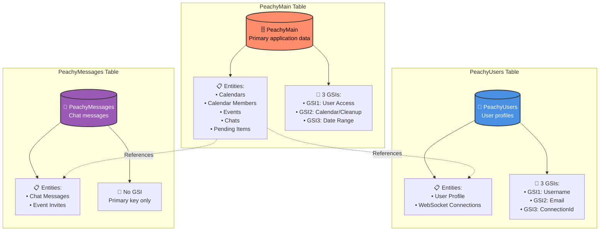
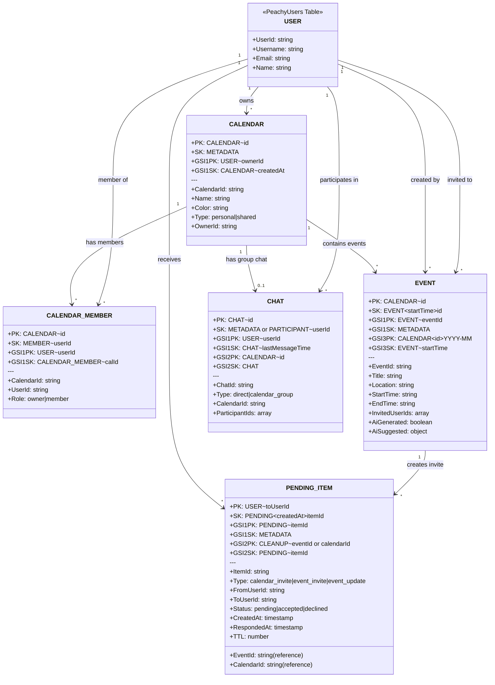
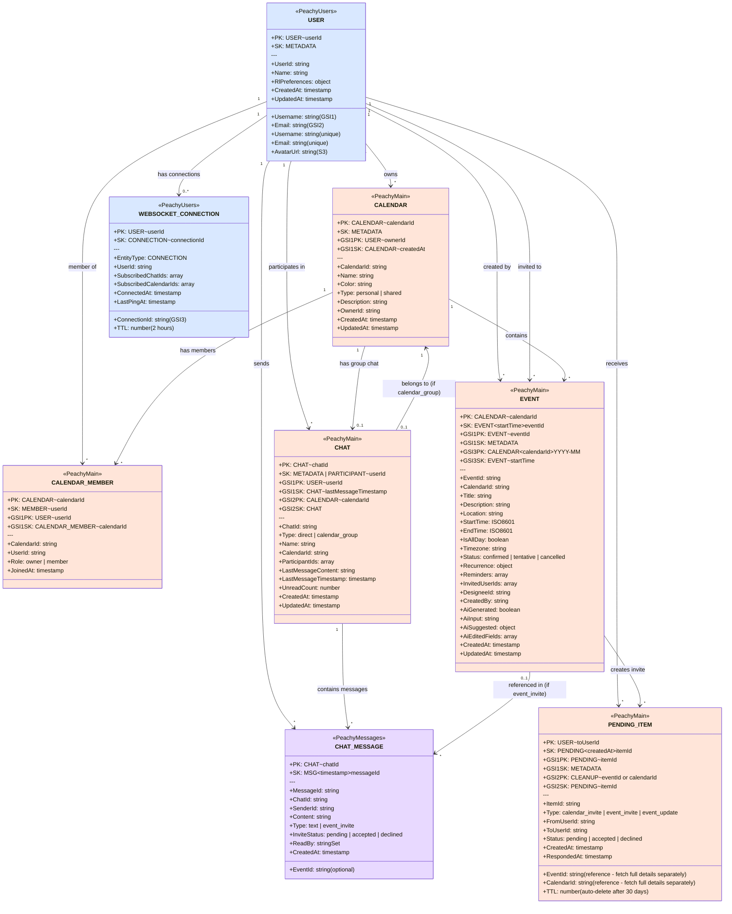
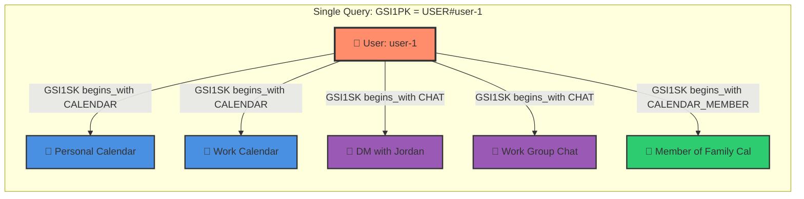
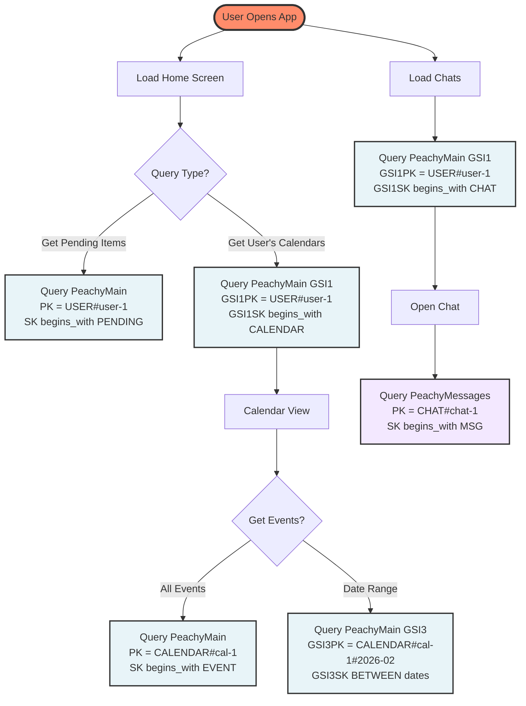
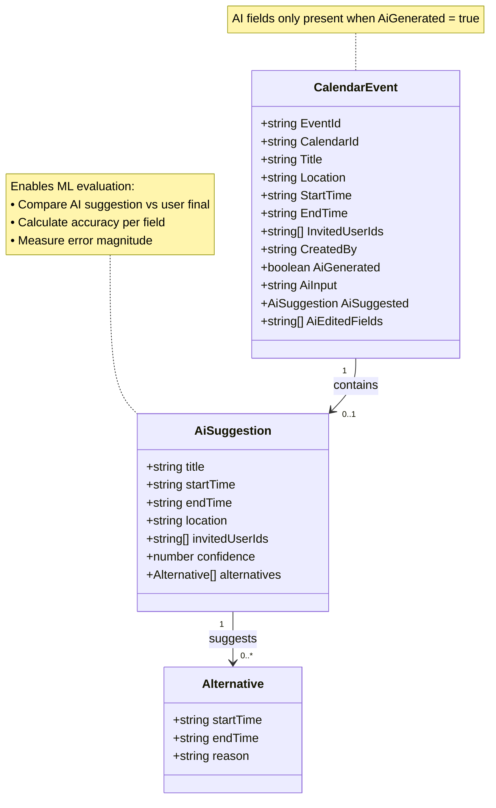
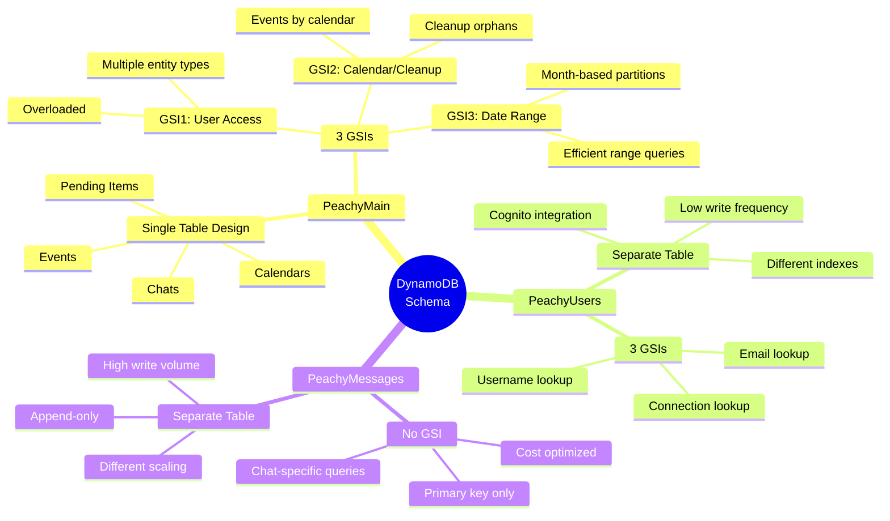

# Peachy DynamoDB Schema Design

## Table of Contents
1. [Overview](#overview)
2. [Visual Schema Diagrams](#visual-schema-diagrams)
3. [Access Patterns](#access-patterns)
4. [Table Structure](#table-structure)
5. [Entity Designs](#entity-designs)
6. [Query Examples](#query-examples)
7. [Why This Design](#why-this-design)

---

## Overview

**Design Philosophy:** Single-table design with composite keys for related entities, separate tables only when justified by different scaling/access patterns.

### Tables:
1. **PeachyMain** - Primary application table (calendars, events, chats, pending items, calendar members)
2. **PeachyUsers** - User profiles (Cognito integration + custom attributes)
3. **PeachyMessages** - Chat messages (high volume, different retention/scaling needs)

---

## Visual Schema Diagrams

### 1. Three-Table Architecture Overview



**Design Philosophy:** Single-table design for related entities (PeachyMain), separate tables only when justified by different scaling/access patterns (Users, Messages).

---

### 2. PeachyMain Entity Relationships



**Note:** USER entity lives in PeachyUsers table, shown here for relationship clarity. All other entities are in PeachyMain table.

---

### 3. Complete Schema - All Entities Across All Tables



**Legend:**
- 🟠 **Peachy (PeachyMain):** Calendars, Members, Events, Chats, Pending Items
- 🔵 **Blue (PeachyUsers):** User profiles, WebSocket connections
- 🟣 **Purple (PeachyMessages):** Chat messages

**Key Relationships:**
1. **User** owns Calendars, creates Events, participates in Chats
2. **Calendar** contains Events, has Members, may have group Chat
3. **Event** creates Pending Items (invites), referenced in Chat Messages
4. **Chat** contains Messages, may belong to Calendar (if calendar_group)
5. **Pending Item** references Event or Calendar (invitations)
6. **WebSocket Connection** belongs to User (real-time updates)

---

### 4. GSI1 Overloading Pattern (User Access Index)



**Key Insight:** One GSI serves multiple query patterns using SK prefixes (CALENDAR, CHAT, CALENDAR_MEMBER).

---

### 4. Access Pattern Flow



---

### 5. Event with AI Fields Schema



**Use Case:** RL training compares `AiSuggested` (what AI suggested) vs final event data (what user created) to improve model accuracy.

---

### 6. Key Patterns Summary



---

## Access Patterns

### User Patterns
- ✅ Get user by ID (Cognito sub)
- ✅ Get user by username (search, @mentions)
- ✅ Get user by email (login)

### Calendar Patterns
- ✅ Get all calendars for a user
- ✅ Get calendar by ID
- ✅ Get calendar members
- ✅ Check if user is member of calendar

### Event Patterns
- ✅ Get all events in a calendar
- ✅ Get events in date range for a calendar
- ✅ Get event by ID
- ✅ Get all events user is invited to
- ✅ Get user's events across all calendars

### Chat Patterns
- ✅ Get all chats for a user
- ✅ Get chat by ID
- ✅ Get chat for a calendar
- ✅ Get messages for a chat (paginated, time-ordered)
- ✅ Get recent messages across all user's chats

### Pending Items Patterns
- ✅ Get all pending items for a user
- ✅ Get pending items by status for a user
- ✅ Get pending item by ID

---

## Table Structure

### Table 1: PeachyMain

**Primary Key:**
- `PK` (Partition Key) - String
- `SK` (Sort Key) - String

**Global Secondary Indexes (GSI):**

#### GSI1: User Access Index
- `GSI1PK` (Partition Key) - For user-centric queries
- `GSI1SK` (Sort Key) - For sorting/filtering
- Use case: Get all items for a user (calendars, chats, pending items)

#### GSI2: Calendar/Chat Lookup Index (also used for Cleanup)
- `GSI2PK` (Partition Key) - For calendar/chat lookups AND cleanup queries
- `GSI2SK` (Sort Key) - For time-based sorting
- Use case: Get events by calendar, get calendar members, cleanup pending items when event/calendar deleted

#### GSI3: Date Range Index
- `GSI3PK` (Partition Key) - For calendar + date queries
- `GSI3SK` (Sort Key) - Start time for range queries
- Use case: Get events in date range

**Attributes:**
- `EntityType` - Discriminator (CALENDAR, EVENT, CHAT, PENDING_ITEM, CALENDAR_MEMBER)
- `CreatedAt` - ISO 8601 timestamp
- `UpdatedAt` - ISO 8601 timestamp
- Entity-specific attributes (JSON)

---

### Table 2: PeachyUsers

**Primary Key:**
- `PK` (Partition Key) - `USER#{userId}` (Cognito sub)
- `SK` (Sort Key) - String (default: "METADATA", or "CONNECTION#{connectionId}" for WebSocket connections)

**Global Secondary Indexes:**

#### GSI1: Username Index
- `Username` (Partition Key) - Unique username
- Use case: Search by username, @mentions

#### GSI2: Email Index
- `Email` (Partition Key) - Unique email
- Use case: Login, search by email

#### GSI3: Connection Lookup (Optional - only if using WebSocket)
- `ConnectionId` (Partition Key) - API Gateway connectionId
- Use case: Quick lookup/delete when WebSocket connection closes

**Entity Types in this Table:**

**User Profile:**
```typescript
{
  PK: "USER#{userId}",
  SK: "METADATA",
  UserId: string,
  Username: string,
  Email: string,
  Name: string,
  AvatarUrl: string,
  CreatedAt: string,
  UpdatedAt: string,

  // RL Preferences (Thompson Sampling for 168 weekly time slots)
  RlPreferences: {
    timeSlotPreferences: {
      // 168 time slots: "Monday_00", "Monday_01", ..., "Sunday_23"
      [timeSlot: string]: {
        alpha: number,  // acceptance count (starts at 1, increments on accept)
        beta: number    // rejection count (starts at 1, increments on decline)
      }
    }
  }
}
```

**WebSocket Connection (Optional - only if implementing real-time):**
```typescript
{
  PK: "USER#{userId}",
  SK: "CONNECTION#{connectionId}",
  EntityType: "CONNECTION",
  ConnectionId: string,        // API Gateway connectionId
  UserId: string,
  SubscribedChatIds: string[],
  SubscribedCalendarIds: string[],
  ConnectedAt: string,
  LastPingAt: string,
  TTL: number                  // Auto-delete after 2 hours of inactivity
}
```

**Why Separate?**
- Different access pattern (Cognito integration)
- Lower write frequency than main table
- User lookups need different indexes (username, email)

**Why Store Connections Here?**
- Keeps total table count at 3 (no separate PeachyConnections table)
- Connections naturally belong to users (same partition key)
- Can query all connections for a user: `PK = USER#{userId} AND SK begins_with CONNECTION`
- TTL still works for auto-cleanup of stale connections

---

### Table 3: PeachyMessages

**Primary Key:**
- `PK` (Partition Key) - `CHAT#{chatId}`
- `SK` (Sort Key) - `MSG#{timestamp}#{messageId}`

**No GSI needed!** All message queries use the primary key (get messages for a specific chat).

**Attributes:**
- `MessageId` - String (UUID)
- `ChatId` - String
- `SenderId` - String (User ID)
- `Content` - String
- `Type` - String (text | event_invite)
- `EventId` - String (optional)
- `InviteStatus` - String (optional: pending | accepted | declined)
- `ReadBy` - String Set (user IDs)
- `CreatedAt` - ISO 8601 timestamp

**Why Separate?**
- High write volume (real-time messaging)
- Different retention policy (might archive old messages)
- Different scaling characteristics
- Messages are append-only (different from main entities)

**Why No GSI?**
- All queries are chat-specific (use primary key: `PK = CHAT#{chatId}`)
- Chat list uses denormalized `lastMessage` on Chat entities (in PeachyMain)
- No cross-chat message queries needed for MVP
- Saves money (no extra GSI storage/write costs)

---

## Entity Designs

### Calendar

```typescript
{
  PK: "CALENDAR#{calendarId}",
  SK: "METADATA",
  GSI1PK: "USER#{ownerId}",
  GSI1SK: "CALENDAR#{createdAt}",
  EntityType: "CALENDAR",

  // Calendar attributes
  CalendarId: string,
  Name: string,
  Color: string,
  Type: "personal" | "shared",
  Description: string,
  OwnerId: string,
  CreatedAt: string,
  UpdatedAt: string
}
```

**Query:**
- Get calendar by ID: `PK = "CALENDAR#{calendarId}" AND SK = "METADATA"`
- Get user's calendars: `GSI1PK = "USER#{userId}" AND GSI1SK begins_with "CALENDAR"`

---

### Calendar Member (Many-to-Many Relationship)

```typescript
{
  PK: "CALENDAR#{calendarId}",
  SK: "MEMBER#{userId}",
  GSI1PK: "USER#{userId}",
  GSI1SK: "CALENDAR_MEMBER#{calendarId}",
  EntityType: "CALENDAR_MEMBER",

  CalendarId: string,
  UserId: string,
  Role: "owner" | "member", // For future RBAC
  JoinedAt: string
}
```

**Query:**
- Get calendar members: `PK = "CALENDAR#{calendarId}" AND SK begins_with "MEMBER#"`
- Get user's calendar memberships: `GSI1PK = "USER#{userId}" AND GSI1SK begins_with "CALENDAR_MEMBER"`

**Why same table as Calendar?**
- Calendar and members are queried together (composite pattern)
- Single query to get calendar + all members
- Membership is tightly coupled to calendar lifecycle

---

### Event

```typescript
{
  PK: "CALENDAR#{calendarId}",
  SK: "EVENT#{startTime}#{eventId}",
  GSI1PK: "EVENT#{eventId}",
  GSI1SK: "METADATA",
  GSI3PK: "CALENDAR#{calendarId}#{year-month}", // e.g., "CALENDAR#123#2026-02"
  GSI3SK: "EVENT#{startTime}",
  EntityType: "EVENT",

  // Event attributes
  EventId: string,
  CalendarId: string,
  Title: string,
  Description: string,
  Location: string,
  StartTime: string (ISO 8601),
  EndTime: string (ISO 8601),
  IsAllDay: boolean,
  Timezone: string,
  Status: "confirmed" | "tentative" | "cancelled",
  Recurrence: RecurrenceRule,
  Reminders: ReminderOffset[],
  InvitedUserIds: string[],
  DesigneeId: string,
  CreatedBy: string,
  CreatedAt: string,
  UpdatedAt: string,

  // AI-generated event fields (optional)
  AiGenerated: boolean,           // true if created from AI parsing
  AiInput: string,                // raw user input: "dinner with Jordan tomorrow at 7pm"
  AiSuggested: {                  // what AI originally suggested (for ML evaluation)
    title: string,
    startTime: string,
    endTime: string,
    location: string,
    invitedUserIds: string[],
    confidence: number,           // AI confidence score (0-1)
    alternatives: Array<{         // alternative time suggestions
      startTime: string,
      endTime: string,
      reason: string              // why this alternative was suggested
    }>
  },
  AiEditedFields: string[]        // fields user changed after AI pre-fill: ["startTime", "location"]
}
```

**Query:**
- Get event by ID: `GSI1PK = "EVENT#{eventId}" AND GSI1SK = "METADATA"`
- Get calendar events: `PK = "CALENDAR#{calendarId}" AND SK begins_with "EVENT#"`
- Get events in month: `GSI3PK = "CALENDAR#{calendarId}#2026-02" AND GSI3SK between "EVENT#2026-02-01" AND "EVENT#2026-02-28"`

**Why same table as Calendar?**
- Events belong to calendars (hierarchical relationship)
- Most queries: "show me events for THIS calendar"
- Efficient single-query access pattern

**AI Fields for ML Evaluation:**

The `AiSuggested` field enables comprehensive model evaluation and RL training:

1. **Calculate Accuracy by Field:**
   ```typescript
   const accuracy = {
     title: event.AiSuggested.title === event.Title,           // 95% accurate
     startTime: event.AiSuggested.startTime === event.StartTime, // 65% accurate
     location: event.AiSuggested.location === event.Location    // 40% accurate
   };
   ```

2. **Measure Error Magnitude:**
   ```typescript
   const timeError = Math.abs(
     new Date(event.StartTime) - new Date(event.AiSuggested.startTime)
   ) / (1000 * 60 * 60); // Hours off
   // Example: AI suggested 7pm, user changed to 8pm = 1 hour error
   ```

3. **Training Data Export (Daily RL Pipeline):**
   ```typescript
   // Scan all AI-generated events
   const trainingData = {
     input: event.AiInput,
     aiSuggested: event.AiSuggested,
     userFinal: {
       title: event.Title,
       startTime: event.StartTime,
       location: event.Location
     },
     editedFields: event.AiEditedFields
   };
   // Export to S3 for SageMaker training
   ```

4. **Identify Patterns:**
   ```typescript
   // Aggregate stats across all events
   // "AI suggests 7pm for dinner, but users prefer 8pm (70% of cases)"
   // → Update prompt to default dinner time to 8pm
   ```

**Storage Strategy:**
- ✅ Store AI suggestion on event itself (no separate table needed)
- ✅ All training data in one DynamoDB scan
- ✅ No joins required for RL pipeline
- ✅ `AiSuggested` only stored when `AiGenerated: true` (sparse field)

**Example:**

Input: `"dinner with Jordan tomorrow"`

AI Suggests:
```json
{
  "title": "Dinner with Jordan",
  "startTime": "2026-02-15T19:00:00Z",  // 7pm
  "location": "Downtown Cafe",
  "confidence": 0.92
}
```

User Changes:
- Time: 7pm → 8pm (Jordan has gym 6-8pm, so 8pm is better)
- Location: Downtown Cafe → Olive Garden

Stored Event:
```json
{
  "Title": "Dinner with Jordan",
  "StartTime": "2026-02-15T20:00:00Z",  // 8pm (final)
  "Location": "Olive Garden",           // final
  "AiGenerated": true,
  "AiInput": "dinner with Jordan tomorrow",
  "AiSuggested": {
    "title": "Dinner with Jordan",
    "startTime": "2026-02-15T19:00:00Z",  // AI said 7pm
    "location": "Downtown Cafe"           // AI said this
  },
  "AiEditedFields": ["startTime", "location"]
}
```

RL Training learns: "Users prefer 8pm over 7pm for dinner (conflict avoidance pattern detected)"

---

### Chat

```typescript
{
  PK: "CHAT#{chatId}",
  SK: "METADATA",
  GSI1PK: "USER#{participantId}", // Duplicate for each participant
  GSI1SK: "CHAT#{lastMessageTimestamp}",
  GSI2PK: "CALENDAR#{calendarId}", // For calendar group chats
  GSI2SK: "CHAT",
  EntityType: "CHAT",

  ChatId: string,
  Type: "direct" | "calendar_group",
  Name: string,
  CalendarId: string, // For calendar group chats
  ParticipantIds: string[],
  LastMessageContent: string, // Denormalized for chat list
  LastMessageTimestamp: string,
  UnreadCount: number, // Per-user, stored in separate items
  CreatedAt: string,
  UpdatedAt: string
}
```

**Multi-item pattern for participants:**
Each chat creates N items (one per participant) for GSI1 queries:
```typescript
{
  PK: "CHAT#{chatId}",
  SK: "PARTICIPANT#{userId}",
  GSI1PK: "USER#{userId}",
  GSI1SK: "CHAT#{lastMessageTimestamp}",
  // ... same chat metadata
}
```

**Query:**
- Get chat by ID: `PK = "CHAT#{chatId}" AND SK = "METADATA"`
- Get user's chats: `GSI1PK = "USER#{userId}" AND GSI1SK begins_with "CHAT"`
- Get chat for calendar: `GSI2PK = "CALENDAR#{calendarId}" AND GSI2SK = "CHAT"`

**Why same table?**
- Chats are tied to calendars (calendar group chats)
- Need to query "get chat for this calendar" efficiently
- Messages in separate table (high volume)

---

### Pending Item

```typescript
{
  PK: "USER#{toUserId}",
  SK: "PENDING#{createdAt}#{itemId}",
  GSI1PK: "PENDING#{itemId}",
  GSI1SK: "METADATA",
  GSI2PK: "CLEANUP#{eventId or calendarId}",  // For cleanup when event/calendar deleted
  GSI2SK: "PENDING#{itemId}",
  EntityType: "PENDING_ITEM",

  // Core fields (reference only - no duplication)
  ItemId: string,
  Type: "calendar_invite" | "event_invite" | "event_update",
  EventId: string,       // Reference to EVENT (fetch details separately)
  CalendarId: string,    // Reference to CALENDAR (fetch details separately)
  FromUserId: string,
  ToUserId: string,
  Status: "pending" | "accepted" | "declined",

  // Timestamps
  CreatedAt: string,
  UpdatedAt: string,
  RespondedAt: string,
  TTL: number  // Unix timestamp, auto-delete after 30 days
}
```

**Query:**
- Get pending item by ID: `GSI1PK = "PENDING#{itemId}" AND GSI1SK = "METADATA"`
- Get user's pending items: `PK = "USER#{userId}" AND SK begins_with "PENDING"`
- **Cleanup when event deleted:** `GSI2PK = "CLEANUP#event-13"` (get all pending items for event)
- **Cleanup when calendar deleted:** `GSI2PK = "CLEANUP#cal-2"` (get all pending items for calendar)

**Client-side enrichment:**
```typescript
// 1. Get pending items (fast query)
const pendingItems = await getPendingItems(userId);

// 2. Extract referenced IDs
const eventIds = pendingItems.filter(i => i.eventId).map(i => i.eventId);
const calendarIds = pendingItems.filter(i => i.calendarId).map(i => i.calendarId);

// 3. Batch get full details
const [events, calendars] = await Promise.all([
  batchGetEvents(eventIds),
  batchGetCalendars(calendarIds)
]);

// 4. Merge in UI
const enriched = pendingItems.map(item => ({
  ...item,
  event: events.find(e => e.eventId === item.eventId),
  calendar: calendars.find(c => c.calendarId === item.calendarId)
}));
```

**Why same table?**
- Pending items are temporary (deleted after action or auto-deleted after 30 days via TTL)
- Related to events and calendars (stores references, not duplicates)
- Small volume compared to messages
- GSI2 enables efficient cleanup when parent entity is deleted

**Design decision:** No duplicate data (title, description, metadata). PENDING_ITEM stores references only. Full event/calendar details fetched separately to maintain single source of truth.

---

## Query Examples

### Example 1: Load User's Home Screen

**Goal:** Get all pending items and recent events

```typescript
// Single query to DynamoDB
const params = {
  TableName: 'PeachyMain',
  KeyConditionExpression: 'PK = :pk AND begins_with(SK, :sk)',
  ExpressionAttributeValues: {
    ':pk': `USER#${userId}`,
    ':sk': 'PENDING'
  }
};

// Separate queries for each calendar's events
// (Or use BatchGetItem for multiple calendars)
```

### Example 2: Load Calendar View

**Goal:** Get calendar metadata + events in month + members

```typescript
// Query 1: Get calendar metadata and members
const calendarParams = {
  TableName: 'PeachyMain',
  KeyConditionExpression: 'PK = :pk',
  ExpressionAttributeValues: {
    ':pk': `CALENDAR#${calendarId}`
  }
};
// Returns: calendar metadata (SK=METADATA) + all members (SK=MEMBER#*)

// Query 2: Get events in date range
const eventsParams = {
  TableName: 'PeachyMain',
  IndexName: 'GSI3',
  KeyConditionExpression: 'GSI3PK = :pk AND GSI3SK BETWEEN :start AND :end',
  ExpressionAttributeValues: {
    ':pk': `CALENDAR#${calendarId}#2026-02`,
    ':start': 'EVENT#2026-02-01T00:00:00Z',
    ':end': 'EVENT#2026-02-28T23:59:59Z'
  }
};
```

### Example 3: Load Chat List

**Goal:** Get all chats for user, sorted by recent activity

```typescript
const params = {
  TableName: 'PeachyMain',
  IndexName: 'GSI1',
  KeyConditionExpression: 'GSI1PK = :pk AND begins_with(GSI1SK, :sk)',
  ExpressionAttributeValues: {
    ':pk': `USER#${userId}`,
    ':sk': 'CHAT'
  },
  ScanIndexForward: false // Most recent first
};
```

### Example 4: Load Chat Messages

**Goal:** Get messages for a chat, paginated

```typescript
// Uses PRIMARY KEY (no GSI needed)
const params = {
  TableName: 'PeachyMessages',
  KeyConditionExpression: 'PK = :pk',
  ExpressionAttributeValues: {
    ':pk': `CHAT#${chatId}`
  },
  ScanIndexForward: false, // Newest first
  Limit: 50,
  ExclusiveStartKey: lastKey // For pagination
};

// This query is very efficient:
// - Single partition (all messages for one chat)
// - Sorted by timestamp (SK = MSG#{timestamp}#{messageId})
// - Supports pagination
// - No GSI needed (saves cost)
```

### Example 5: Scan AI-Generated Events for RL Training

**Goal:** Get all AI-generated events for model evaluation (runs daily at 2am)

```typescript
// Scan PeachyMain for AI-generated events
const params = {
  TableName: 'PeachyMain',
  FilterExpression: 'EntityType = :type AND AiGenerated = :aiGen',
  ExpressionAttributeValues: {
    ':type': 'EVENT',
    ':aiGen': true
  }
};

const result = await dynamodb.scan(params);

// Extract training data
const trainingData = result.Items.map(event => ({
  input: event.AiInput,
  aiSuggested: event.AiSuggested,
  userFinal: {
    title: event.Title,
    startTime: event.StartTime,
    endTime: event.EndTime,
    location: event.Location,
    invitedUserIds: event.InvitedUserIds
  },
  editedFields: event.AiEditedFields,
  createdAt: event.CreatedAt
}));

// Calculate metrics
const metrics = {
  totalEvents: trainingData.length,
  accuracyByField: {
    title: trainingData.filter(d =>
      d.aiSuggested.title === d.userFinal.title
    ).length / trainingData.length,

    startTime: trainingData.filter(d =>
      d.aiSuggested.startTime === d.userFinal.startTime
    ).length / trainingData.length,

    location: trainingData.filter(d =>
      d.aiSuggested.location === d.userFinal.location
    ).length / trainingData.length
  },
  editRate: trainingData.filter(d =>
    d.editedFields && d.editedFields.length > 0
  ).length / trainingData.length
};

// Export to S3 for SageMaker
await s3.putObject({
  Bucket: 'peachy-ml-training',
  Key: `events/${new Date().toISOString().split('T')[0]}.json`,
  Body: JSON.stringify({ trainingData, metrics })
});
```

**Note:** Scans can be expensive. For production, consider:
- Using date-based filtering to scan only recent events
- Incremental exports instead of full scans
- DynamoDB Streams to capture AI events in real-time

### Example 6: WebSocket Connection Management (Optional)

**Goal:** Manage WebSocket connections for real-time chat (if implemented)

**Store connection when user connects:**
```typescript
await dynamodb.put({
  TableName: 'PeachyUsers',
  Item: {
    PK: `USER#${userId}`,
    SK: `CONNECTION#${connectionId}`,
    EntityType: 'CONNECTION',
    ConnectionId: connectionId,
    UserId: userId,
    SubscribedChatIds: ['chat-1', 'chat-2'],
    ConnectedAt: '2026-02-14T10:00:00Z',
    TTL: 1708088400  // 2 hours
  }
});
```

**Get all connections for a user:**
```typescript
const params = {
  TableName: 'PeachyUsers',
  KeyConditionExpression: 'PK = :pk AND begins_with(SK, :sk)',
  ExpressionAttributeValues: {
    ':pk': `USER#${userId}`,
    ':sk': 'CONNECTION#'
  }
};
// Returns all active WebSocket connections for this user
```

**Find connection by connectionId (when disconnecting):**
```typescript
const params = {
  TableName: 'PeachyUsers',
  IndexName: 'GSI3-ConnectionId',
  KeyConditionExpression: 'ConnectionId = :connId',
  ExpressionAttributeValues: {
    ':connId': connectionId
  }
};
// Returns the connection item, then delete using PK/SK
```

**Broadcast message to chat participants:**
```typescript
// 1. Get chat participants
const chat = await dynamodb.get({
  TableName: 'PeachyMain',
  Key: { PK: `CHAT#${chatId}`, SK: 'METADATA' }
});

// 2. Get all connections for each participant
const connections = [];
for (const userId of chat.Item.ParticipantIds) {
  const result = await dynamodb.query({
    TableName: 'PeachyUsers',
    KeyConditionExpression: 'PK = :pk AND begins_with(SK, :sk)',
    ExpressionAttributeValues: {
      ':pk': `USER#${userId}`,
      ':sk': 'CONNECTION#'
    }
  });

  // Filter by subscribed chats
  const userConns = result.Items.filter(conn =>
    conn.SubscribedChatIds?.includes(chatId)
  );
  connections.push(...userConns);
}

// 3. Broadcast to all connections via API Gateway Management API
for (const conn of connections) {
  await apiGateway.postToConnection({
    ConnectionId: conn.ConnectionId,
    Data: JSON.stringify({ type: 'chat_message', data: message })
  });
}
```

---

## Why This Design?

### ✅ Single Table for Related Entities

**PeachyMain contains:**
- Calendars
- Calendar Members
- Events
- Chats
- Pending Items

**Why?**
1. **Efficient Access Patterns:** Most queries need related data (calendar + events, calendar + members)
2. **No Joins Needed:** DynamoDB doesn't support joins, so keeping related data in one table allows single-query access
3. **Cost Effective:** Fewer tables = less provisioned capacity = lower costs
4. **Consistent Performance:** Related items stored together on same partition (when using same PK)

**Example:** Loading a calendar view needs:
- Calendar metadata
- Calendar members
- Events in date range

With single table: 2 queries (one for calendar+members, one for events)
With separate tables: 3 queries + more network overhead

---

### ✅ Separate Table for Users

**PeachyUsers is separate because:**
1. **Different Access Pattern:** Users accessed by username/email (requires different indexes)
2. **Cognito Integration:** User auth handled by Cognito, this table just extends with custom attributes
3. **Lower Write Frequency:** User profiles change infrequently vs events/messages
4. **Security:** User PII needs different encryption/access controls

---

### ✅ Separate Table for Messages

**PeachyMessages is separate because:**
1. **High Volume:** Messages are append-only and high-frequency writes
2. **Different Scaling:** Messages might need different provisioned capacity
3. **Different Retention:** Might archive old messages (TTL, move to S3)
4. **Read Pattern:** Messages always queried by chat (perfect for partition key)
5. **Focused Queries:** Single partition per chat enables efficient pagination and time-based queries

---

### Key Design Decisions

#### Composite Keys
- Using composite sort keys (e.g., `EVENT#{startTime}#{eventId}`) allows:
  - Automatic sorting by time
  - Efficient range queries
  - Uniqueness guarantee

#### Denormalization
- Chat stores `lastMessage` to avoid extra query on chat list
- Acceptable because updates are infrequent and controlled

#### GSI Overloading
- GSI1 serves multiple purposes (user's calendars, user's chats, user's pending items)
- Discriminated by SK prefix
- Reduces number of GSIs needed (cost optimization)

#### Multi-item Pattern for Many-to-Many
- Calendar memberships stored as separate items
- Allows efficient queries in both directions:
  - Get members for calendar: `PK = CALENDAR#{id}`
  - Get calendars for user: `GSI1PK = USER#{id}`

---

## Cost Optimization Notes

1. **Read/Write Units:**
   - Main table: Medium write, high read (events viewed frequently)
   - Users table: Low write, medium read
   - Messages table: High write, high read (real-time chat)

2. **On-Demand vs Provisioned:**
   - Consider on-demand for PeachyMessages (spiky traffic)
   - Provisioned for PeachyMain (predictable usage)

3. **TTL for Pending Items:**
   - Set TTL on pending items (auto-delete after 30 days if not responded)
   - Reduces storage costs

4. **Sparse Indexes:**
   - GSI3 only populated for events (not all items)
   - Saves GSI storage costs

5. **No GSI on PeachyMessages:**
   - Messages table has NO GSI (only primary key)
   - Saves 50% on message write costs (no GSI write units)
   - Saves 100% on GSI storage costs
   - All queries use primary key (chat-specific messages)

---

## Future Considerations

### Potential Additional Tables:
1. **PeachyNotifications** - Push notification queue (if separate from pending items)
2. **PeachyAuditLog** - Event history for compliance
3. **PeachyAnalytics** - Usage metrics (separate from operational data)

### Potential Optimizations:
1. **DAX (DynamoDB Accelerator)** - For frequently accessed items (calendar metadata)
2. **DynamoDB Streams** - For real-time updates, triggers, sync
3. **Global Tables** - Multi-region if needed for global users

### If You Add Cross-Chat Message Features:

**Feature: Global Message Search** ("Find all messages containing 'dinner'")

**Option 1: Add GSI to PeachyMessages** (not recommended)
- GSI1PK: `USER#{userId}`, GSI1SK: `MSG#{timestamp}`
- Allows querying all messages for a user
- ❌ Still requires client-side filtering (not real search)
- ❌ Expensive (doubles write cost for every message)

**Option 2: ElasticSearch/OpenSearch** (recommended)
- DynamoDB Streams → Lambda → OpenSearch
- Full-text search with relevance ranking
- Filters (by date, sender, chat, attachments)
- Much faster and cheaper for search use cases
- ✅ Better UX (instant search results, fuzzy matching)

**For MVP:** No search feature needed, so skip both options!

---

## S3 Storage (Binary Files)

**Rule:** Never store binary data in DynamoDB. Use S3 + store URLs in DynamoDB.

### Avatar Storage

**DynamoDB (PeachyUsers):**
```typescript
{
  UserId: "user-1",
  AvatarUrl: "https://cdn.peachy.app/avatars/user-1/avatar.jpg",  // ← S3 URL
  // NOT: AvatarData: <binary>  ❌
}
```

**S3 Bucket Structure:**
```
peachy-storage/
  avatars/
    user-1/
      avatar.jpg         (256x256, optimized for profile)
      avatar-thumb.jpg   (64x64, for chat bubbles)
    user-2/
      avatar.jpg
      avatar-thumb.jpg
```

**Upload Flow:**
1. Client requests: `GET /users/me/avatar/upload-url`
2. Server generates presigned S3 URL (expires in 5 minutes)
3. Client uploads directly to S3 using presigned URL
4. Client updates profile: `PUT /users/me` with `avatarUrl`
5. (Optional) Lambda trigger processes image: resize, compress, generate thumbnail

**CloudFront CDN:**
- Domain: `cdn.peachy.app`
- Origin: S3 bucket `peachy-storage`
- Cache: 1 year (avatars rarely change)
- Invalidate: On user avatar update

**Why S3?**
- DynamoDB item limit: 400KB
- Average avatar: 50-500KB
- S3 is 10x cheaper for large files
- CloudFront for fast global delivery

### Future: Chat Media (Images/Videos)

**When you add media sharing to chat:**

```typescript
// DynamoDB (PeachyMessages)
{
  MessageId: "msg-123",
  Type: "image",
  MediaUrl: "https://cdn.peachy.app/media/chat-1/2026/02/msg-123.jpg",  // ← S3
  ThumbnailUrl: "https://cdn.peachy.app/media/chat-1/2026/02/msg-123-thumb.jpg",
  MediaSize: 245678,
  // NOT: MediaData: <binary>  ❌
}
```

**S3 Structure:**
```
peachy-storage/
  media/
    chat-1/
      2026/02/
        msg-123.jpg
        msg-123-thumb.jpg
```

**Lifecycle Policy:**
- Delete media > 1 year old (save costs)
- Archive to Glacier after 90 days

### S3 Bucket Configuration

**Single Bucket with Prefixes (Recommended):**
```
peachy-storage/
  avatars/     (public-read via CloudFront)
  media/       (private, presigned URLs)
  files/       (private, for future event attachments)
```

**Bucket Policy:**
- Enable CORS (for direct client upload)
- Encryption at rest (S3-SSE)
- Versioning: Disabled (not needed)
- Public access: Blocked (use CloudFront)

**Cost Estimate:**
- 1000 users × 100KB avatar = 100MB = **$0.02/month**
- Negligible for student project

---

## Migration from Mock Data

Current mock data maps directly to this schema:
- `mockCalendars` → PeachyMain (CALENDAR entities)
- `mockEvents` → PeachyMain (EVENT entities)
  - Events with `aiGenerated: true` should include `aiSuggested` field for ML evaluation
- `mockChats` → PeachyMain (CHAT entities) + PeachyMessages
- `mockPendingItems` → PeachyMain (PENDING_ITEM entities)
- `currentUser` + `contacts` → PeachyUsers
- User `avatarUrl` → S3 bucket `peachy-storage/avatars/`

The TypeScript types remain the same, only storage layer changes!

**Example Mock Event with AI Fields:**
```typescript
{
  id: 'event-13',
  calendarId: 'cal-2',
  title: 'Team Lunch',
  startTime: '2026-02-15T12:00:00Z',
  location: 'Downtown Cafe',

  // AI metadata for testing ML evaluation
  aiGenerated: true,
  aiInput: 'lunch with the team tomorrow',
  aiSuggested: {
    title: 'Team Lunch',
    startTime: '2026-02-15T12:00:00Z',  // AI got this right
    location: 'Office Cafeteria',       // User changed this
    invitedUserIds: ['user-2', 'user-3'],
    confidence: 0.88,
    alternatives: [
      { startTime: '2026-02-15T11:30:00Z', endTime: '2026-02-15T12:30:00Z', reason: 'Earlier option' },
      { startTime: '2026-02-15T13:00:00Z', endTime: '2026-02-15T14:00:00Z', reason: 'Later option' }
    ]
  },
  aiEditedFields: ['location']  // User only changed location
}
```

---

## API Integration

**See `API_SPECIFICATION.md` for complete API documentation.**

The API specification includes:
- 39 REST endpoints
- Authentication flows (Cognito)
- Business logic and side effects
- File upload strategies
- Chat message polling/refresh patterns
- AI endpoints (TBD)
- Rate limiting and error handling
- Frontend integration checklist

This schema document focuses on **data modeling**, while the API spec covers **business logic and integration**.

**Note:** Real-time features (WebSocket) are optional and not required for MVP. The schema supports both polling-based chat (simple) and WebSocket chat (if added later).

### Authentication APIs (AWS Cognito)

#### POST /auth/signup
```typescript
Request: {
  email: string;
  password: string;
  name: string;
  username: string; // Must be unique
}
Response: {
  userId: string;
  email: string;
  emailVerified: boolean;
}
