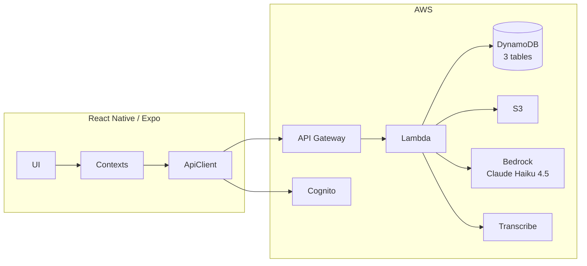

# Peachy: Intelligent Mobile Calendar with Shared Scheduling and Messaging

> [!NOTE]
> Due to circumstances outside of our control (AWS account quota issues, credits being used up by another team), we were blocked on Bedrock integration for the majority of the term. Therefore, we have had little time to test and refine portions of our solution relying on Bedrock output.

**Team:** Yibing Ju (1009382829), Cynthia Zhou (1009028918), Jonathan Chen (1008849310), Mark Noge (1008992299)

---

## Abstract

Peachy is an intelligent mobile calendar that unifies natural-language scheduling, shared calendars, and in-app messaging into a single workflow. The system combines a React Native (Expo) client with a serverless AWS backend (Lambda, API Gateway, DynamoDB, Cognito, S3) and a hybrid AI pipeline using LLM tool-calling for intent parsing and Thompson sampling for time-slot preference learning. The current implementation includes full mobile UI flows, a typed API client, Cognito-based auth, push notifications, and a CDK-defined backend with calendar, event, chat, pending-invite, friends, RL-preferences, and transcription endpoints. This report covers the problem, design, experiments, and results.

---

## 1. Introduction and Problem Statement

Scheduling with others is harder than it should be. Group chats fill up with availability questions, calendars don't share data, and converting "we should meet" into an actual event requires coordination most users lack capacity for. Existing tools address fragments of this problem but not the whole: dedicated calendar apps have no group coordination, scheduling tools require per-event setup, and AI assistants operate in isolation from social context.

Peachy addresses this by unifying calendar management, shared scheduling, and chat, with AI-supported natural-language input. The core proposition: a user says *"dinner with Jordan tomorrow"* and the system checks everyone's availability, picks a suitable time using learned preferences, creates the event, and sends invites — end to end. The goal is to reduce multi-step coordination to a single sentence while keeping users' social graph and preferences private and local to the app.

---

## 2. Related Work

### 2.1 Academic

Peachy's AI pipeline builds on three lines of work. LLMs with tool-calling (Brown et al., 2020; Wei et al., 2022) enable structured intent extraction from free-form text. Thompson sampling (Sutton & Barto, 2018) provides a principled exploration-exploitation framework for learning per-user time-slot preferences without requiring explicit ratings. Conversational scheduling systems (Young et al., 2013) motivate the deterministic post-processing layer that corrects LLM output rather than relying on multi-turn dialog to resolve errors.

### 2.2 Industry

The team analyzed twelve existing products to identify the gap Peachy fills:

| Category | Tools | Key Gap |
|----------|-------|---------|
| Availability sharing | When2meet, Doodle, crab.fit | Binary availability, new link per event, no calendar integration |
| Meeting automation | Calendly, Cal.com | Enterprise-focused; no friend-based social planning |
| Shared calendars | TimeTree (70M users), Apple/Google/Outlook | No AI; minimal social coordination |
| AI scheduling | Reclaim.ai, Clockwise | Individual productivity only; no shared social scheduling |
| Social scheduling | Rodeo | Waitlist; dating-app-adjacent targeting |

**Summary:** Tools fall into two extremes — complex enterprise platforms and lightweight availability polls. AI-driven tools optimize individual schedules, not group coordination. None combine shared calendars, integrated chat, and natural-language scheduling in a mobile-first, social context.

### 2.3 Datasets

For AI evaluation, the team assessed five aspirational dataset types (NL-to-event pairs, longitudinal schedule patterns, event taxonomy, conflict resolution, completion history) and seven real public datasets (Enron emails, ATUS, Microsoft BA-Calendar, Google DeepMind Natural Plan, KVRET, Meetup.com events, OpenStreetMap POI). None fully match Peachy's input/output schema; all require significant preprocessing. **Decision:** construct a small internal evaluation dataset from real app usage, with external datasets as fallback for prompt tuning.

---

## 3. Technical Approach, Solution, and Design

### 3.1 System Architecture

**Client:** React Native (Expo SDK 54), Expo Router, TypeScript. Full mobile UI: day/week/month calendar views, event create/edit/detail modals, shared calendar management, messaging, and an AI input bar. React Context providers for auth, calendars, friends, and chat. JWT tokens stored in SecureStore; a typed API client handles 401 auto-logout. Push notifications via `expo-notifications`.

**Backend:** AWS Serverless, defined as Infrastructure-as-Code in CDK TypeScript. Seven stacks: Auth (Cognito + Google OAuth), Database (DynamoDB), Storage (S3), Notifications (SES domain identity — provisioned for future transactional email, not yet sending), AI (Bedrock invoker role), API (REST Gateway + 31+ Lambda handlers), Monitoring (CloudWatch + AWS Budgets). Dev/prod environments share one codebase; `--context env=dev|prod` switches removal policies and auth config.

### 3.2 Data Model

Three DynamoDB tables with single-table design for related entities:

- **PeachyMain** — Calendars, Members, Events, Chats, Pending Items. Three GSIs: User Access (GSI1), Calendar Cleanup (GSI2), Date Range (GSI3). TTL on pending items (30-day auto-cleanup).
- **PeachyUsers** — User profiles, RL weights, WebSocket connections. GSIs for username, email, and connectionId lookup. TTL on connections (2-hour cleanup).
- **PeachyMessages** — Chat history. No GSI by design (append-only, saves 50% write cost). All queries on `PK=CHAT#{chatId}, SK begins_with MSG#`.

PITR enabled in production; `RemovalPolicy.RETAIN` on all data-bearing resources so tables, S3 bucket, and Cognito user pool survive `cdk destroy`.

### 3.3 AI Scheduling Pipeline

A `analyzeInput()` decision function routes each request to one of two paths:

| Condition | Path |
|-----------|------|
| Exactly 1 explicit time | **Fast** — simple Bedrock prompt, no DB fetch |
| Multiple times offered, or planning keyword, or @mention | **Smart** — fetch availability + RL preferences |

**Smart path (7 steps):** (1) extract @mentions; (2) `parseDateHint()` resolves the date window from natural language; (3) parallel DynamoDB fetches — resolve @mentions via GSI1-Username, get caller's calendars via GSI2, get RL weights; (4) fetch participant events via GSI3-DateRange (projection: StartTime, EndTime only); (5) `calculateFreeWindows()` merges busy blocks in 1-hour slots; (6) `thompsonSampleAll()` samples Beta(α, β) for all 168 weekly slots, returns top 5 preferred hours; (7) call Bedrock with enriched prompt (free windows, preferences, participant IDs).

**Bedrock integration:** Model `anthropic.claude-haiku-4-5-20251001-v1:0`. Forced tool use (`tool_choice: { type: 'tool', name: 'parse_event' }`) guarantees structured JSON output. User input wrapped in `<user_input>` tags for prompt injection mitigation. One retry on throttling/timeout errors.

**Post-AI validation (`validateEventTiming`)** — 7-step deterministic correction layer: (1) past dates advanced; (2) end-before-start swapped; (3) wrong day-of-week corrected; (4) unreasonable hours adjusted to 9am local, with EXPLICIT_LATE_NIGHT exemption; (5) UTC/local confusion corrected; (6) day-name enforcement; (7) conflict-snap — events moved to nearest free window if they overlap existing calendar entries.

**RL feedback loop:** Each slot stores α (accepts) and β (rejections). Accepting an AI-suggested time increments α; changing it increments β for the AI slot and α for the user's chosen slot. `AiGenerated`, `AiInput`, and `AiEditedFields` stored on every AI-created event for offline per-field edit-rate analysis.

### 3.4 Infrastructure and DevOps

**IaC design principles:** One CDK stack per logical service; centralized IAM utilities in `iam.ts` for consistent least-privilege policies; shared Lambda layer (`lambda/shared/`) for common dependencies. Environment config typed in `resources/config.ts`.

**Disaster recovery:** With RETAIN policies, a full stack destruction leaves orphaned-but-intact data resources in AWS. `scripts/recover-prod.ps1` discovers orphaned resources via AWS CLI, builds CloudFormation import changesets to re-adopt them, then runs `cdk deploy` to recreate stateless resources. Documented in `RUNBOOK.md`; validated with a 37-minute uncut demo.

**CI/CD:** GitHub Actions on push/PR to `main`/`dev`. The README displays live coverage badges, and PRs receive automated per-file coverage diffs via `ArtiomTr/jest-coverage-report-action` to highlight regressions and gains.

---

## 4. Experiments, Key Metrics, and Results

### 4.1 Test Coverage

**What is tested:**
Front-end tests cover core UI flows, context state transitions, component rendering, and date/calendar utilities. Backend tests include Lambda unit tests across domains, CDK assertion tests for all stacks, and handler-level integration tests for complex AI parse behavior. CDK assertion tests synthesize stacks and verify CloudFormation output via `aws-cdk-lib/assertions` without deploying. Lambda unit tests use `aws-sdk-client-mock` to isolate CPU logic from I/O. Integration tests that hit real API Gateway endpoints are run manually and excluded from CI, as are live Bedrock end-to-end tests (`__tests__/integration/ai/`).

**What is not tested (by design):**
Native Expo push APIs, the HTTP API client, pixel-positioned calendar grid views, AWS Transcribe/Bedrock live calls, and DynamoDB timeout-based retry logic. These require live infrastructure or native device APIs unavailable in Jest.

### 4.2 Profiling and Optimization

Using Node.js `perf_hooks` with mocked external I/O (DynamoDB: 5–50ms in production; Bedrock: 500–3000ms), the team profiled five Lambda functions to isolate CPU-bound bottlenecks. Mocking at near-zero latency reveals the optimizable work.

**Summary of all fixes:**

| Function | Metric | Before | After | Improvement |
|---------|--------|--------|-------|-------------|
| `parseDateHint` (with timezone) | per-call | 0.258ms | 0.010ms | **96% faster** |
| `parseDateHint` timezone overhead | ratio vs no-tz | 66–74x | 5–6x | **~12x better** |
| `validateEventTiming` (avg) | per-call | 0.893ms | 0.095ms | **89% faster** |
| `validateEventTiming` (42 conflict windows) | per-call | 3.776ms | 0.230ms | **94% faster** |
| `updateEvent` (in-place) | per-call | 1.22ms | 0.56ms | **54% faster** |
| `updateEvent` (delete-recreate) | per-call | 1.59ms | 0.74ms | **53% faster** |
| `aiParse` (smart path, no mentions) | per-call | 16.30ms | 3.94ms | **76% faster** |
| `thompsonSampleAll` | structural | full sort 168 | topK=5 selection | Correct; noise in timing |
| `userSearch` | per-call | 0.79ms | — | No change (already efficient) |

**Root causes and fixes:**

- **Fix 1 — Cache `Intl.DateTimeFormat` instances** (`date-utils.ts`): `parseDateHint` and `validateEventTiming` are pure functions called on every AI parse request. Every timezone-aware call constructed a new `Intl.DateTimeFormat` — 66–74x slower than no-timezone. A module-level `Map<string, Intl.DateTimeFormat>` cache reduced overhead to 5–6x.
- **Fix 2 — Pre-parse conflict window timestamps** (`date-utils.ts`): The conflict-snap loop called `new Date()` and `getLocalHour()` per window per iteration. Refactored to pre-compute epoch milliseconds and local hours once before the loop.
- **Fix 3 — Thompson sampling topK + default prior** (`thompson.ts`): Beta sampling dominates at 89.5% of runtime. Added a pre-allocated `DEFAULT_PRIOR` constant (eliminates 168 object allocations per call for sparse weights) and an optional `topK` parameter using O(n×K) selection instead of O(n log n) full sort when callers only need top 5 slots.
- **Fix 4 — Data-driven field mapping loop** (`update-event/index.ts`): 11 repetitive if-blocks in the update expression builder replaced with a single `UPDATABLE_FIELDS` array and a loop, reducing ~70 lines to ~15.

### 4.3 Test Depth: AI Parse Pipeline

The AI parse pipeline (`lambda/ai/parse/`) was chosen as the primary deep-testing target — it is the most complex feature (~560 lines, 15+ external calls, two execution paths) and every bug produces events at the wrong time, day, or double-booked.

**74 tests across 4 suites:** 30 handler-level integration tests (`tests/ai/parse.test.ts` — single-user; `tests/ai/parse-mentions.test.ts` — multi-person), 30 unit tests for `parseDateHint`/`validateEventTiming` with injectable `now` and timezone, 14 unit tests for @mention resolution and friendship filtering. All use realistic natural language inputs ("soccer on thursday", "dinner with @brian at 8pm") rather than synthetic strings to exercise the same routing users experience.

Test categories: positive (happy path field population), regression (each of the bugs below), negative (bad input, service failure, non-friend exclusion), and edge cases (UTC day-boundary crossing, overlapping multi-participant busy blocks, staggered conflicts).

**Bug discovered during testing:** `analyzeInput()` checked for an explicit time before checking for @mentions. Inputs like "dinner with @brian at 8pm" had exactly 1 explicit time, triggering the fast-path early return and silently dropping the friend from `invitedUserIds`. Fixed by moving the @mention check above the explicit-time check.

### 4.4 Model Evaluation

The current AI scheduling pipeline and Bedrock model choices were evaluated using a framework that tests 22 sample use cases across 7 categories. Outputs are scored across 6 weighted dimensions, in addition to other performance metrics including latency and cost.

| Category | Workflow path | Number of cases |
|----------|---------------|-----------------|
| Explicit time | fast-path | 5 |
| Vague date | smart-path | 4 |
| Day-name resolution | smart-path | 4 |
| Late night | fast-path | 3 |
| Conflict snapping | smart-path | 2 |
| @Mentions | smart-path | 2 |
| Edge cases | N/A | 2 |

| Dimension | Weight | Pass condition |
|-----------|--------|----------------|
| `dayCorrect` | 0.25 | Local day-of-week matches `expectedDay` |
| `futureDate` | 0.20 | `startTime` is after `frozenNow` |
| `hourInRange` | 0.20 | Local hour within `expectedHourRange` |
| `endAfterStart` | 0.15 | `endTime > startTime` |
| `notAdjusted` | 0.15 | `validateEventTiming` did not need to correct the output (inverted when `expectAdjusted: true`) |
| `titleNonEmpty` | 0.05 | `title.trim().length > 0` |

Vertical testing revealed that upgrading model families (fast path: Haiku to Sonnet, smart path: Sonnet to Opus) provided similar output quality (-0.01 in cumulative score) while resulting in >118% increase in latency and incurring >76% increase in cost (see Appendix A).

We also compared the production prompt against a 2-shot prompt variant (`nshot`) using the same 22-case suite (2026-03-30). The `nshot` variant improved average score and significantly reduced safety-net corrections, at the cost of higher input tokens and overall cost (see Appendix B).

### 4.5 Two Memorable Bugs

**Bug 1 — Dark mode display.** Black text on dark backgrounds; hard-coded color values instead of theme-aware calls. Two developers independently hit this when generating code with Claude — indicating a systemic gap in shared AI context, not a one-off mistake. Fixed with `useThemeColor()` and `<ThemedText>`/`<ThemedView>` wrappers; CLAUDE.md updated with theming guidance; unit tests added to verify stylesheet color sourcing.

**Bug 2 — AI parse timezone mismatch.** Three failure categories: time mismatch, day mismatch, scheduling conflicts. The Lambda runs UTC; users are in local time (EDT = UTC-4). The timezone was threaded into `callBedrock()` for prompt formatting but not into `parseDateHint()` (which used `new Date()` = UTC) or `validateEventTiming()` (which used `getUTCHours()`). Additionally, Bedrock returned wrong-day dates and ignored calendar conflicts. Fixed by threading timezone consistently through all date functions and adding the 7-step `validateEventTiming` correction pipeline. **Lesson:** prior tests were UTC-only, masking the issue entirely; never trust LLM temporal output without deterministic validation.

### 4.6 Performance Targets

| Target | Goal | Status |
|--------|------|--------|
| API latency (CRUD) | < 500ms | Designed for; end-to-end benchmarks pending full backend deployment |
| AI scheduling — simple | < 2s | CPU overhead <4ms; Bedrock I/O (500–3000ms) dominates |
| AI scheduling — complex | < 5s | Smart path CPU reduced 76%; end-to-end pending live integration |
| Offline startup | Near-instant | Planned; local persistence layer not yet implemented |

---

## 5. Future Work and Next Steps

- **Backend completion:** Chat polling (5s interval when open), profile photo upload via S3 presigned URLs, remaining invitation management endpoints.
- **AI pipeline:** Follow-up dialog for ambiguous inputs; A/B test Claude Haiku vs Sonnet using `AiEditedFields` edit-rate signal; evals using established tools such as Langfuse for programmatic comparisons of prompt variants.
- **Offline storage:** Local persistence layer (SQLite or AsyncStorage) with conflict resolution.
- **Email:** Real domain + DNS (DKIM, SPF, DMARC), SES production access, welcome/reset/invite email templates.
- **Security:** Migrate Google OAuth secret to Secrets Manager; add Bedrock Guardrails; add CloudWatch alarms (Lambda errors, API Gateway 5xx, DynamoDB throttles).
- **Accessibility:** WCAG 2.1 AA audit across major flows.

---

## 6. Team Reflection and Course Connection

Peachy gave the team end-to-end experience across requirements engineering, system design, applied ML, infrastructure, and testing discipline — the full arc of the course.

The most concrete course connection was the data pipeline work. We defined aspirational datasets, assessed real public datasets and their limitations, decided pragmatically to collect internal evaluation data, implemented a live pipeline, profiled it, found bugs, fixed them, and wrote regression tests. This is the ML engineering lifecycle — not just model selection, but the surrounding validation and iteration infrastructure.

The profiling exercise reinforced a principle that applies broadly: measure before optimizing. The dominant bottleneck was `Intl.DateTimeFormat` construction — a 66–74x timezone overhead that was invisible until we mocked I/O to isolate CPU. Without profiling, we would have optimized the wrong things.

Infrastructure as a first-class artifact was a third key theme. Defining CDK stacks early forced decisions about permissions, data lifecycle, and operational constraints before they became blocking problems. In particular, discussions on the cost and latency of different services with respect to different use cases encouraged us to consider our infrastructure decisions in greater detail. The disaster recovery exercise — destroying and recovering a production environment from RETAIN orphans — is the kind of operational practice rarely addressed in coursework but essential in production systems.

Additionally, course discussion on the importance of LLM evals directly influenced our eval framework, decoupling evaluation from deployment and operationalizing the cost/quality tradeoff explicitly. Distinguishing between correct model output and output bailed out by the safety net allows us to improve our model pipeline with confidence.

Finally, the dark mode bug taught us something about AI-assisted development: Claude produces consistent code only when given consistent context. Updating CLAUDE.md with architectural decisions and code patterns reduced inter-developer inconsistency more effectively than code review alone. Maintaining a shared AI context file is a new kind of team practice that emerged directly from this project.

In conclusion, Peachy demonstrates that integrated scheduling, shared calendars, and messaging can be delivered with strong reliability and performance when paired with deterministic validation and disciplined evaluation. The project validated our architectural choices, highlighted the cost-quality tradeoffs of model selection, and established a foundation for iterative improvement.

---

## References

- Brown, T. B., et al. (2020). Language models are few-shot learners. *NeurIPS*. https://arxiv.org/abs/2005.14165
- Wei, J., et al. (2022). Chain-of-thought prompting elicits reasoning in large language models. *NeurIPS*. https://arxiv.org/abs/2201.11903
- Sutton, R. S., & Barto, A. G. (2018). *Reinforcement Learning: An Introduction* (2nd ed.). http://incompleteideas.net/book/the-book-2nd.html
- Young, S., et al. (2013). POMDP-based statistical spoken dialog systems: A review. *Proceedings of the IEEE*. https://ieeexplore.ieee.org/document/6592993
- Google Calendar. https://calendar.google.com — Microsoft Outlook Calendar. https://outlook.microsoft.com — Apple Calendar. https://support.apple.com/guide/calendar/welcome/mac
- Calendly. https://calendly.com — Motion. https://www.usemotion.com — Reclaim.ai. https://reclaim.ai — Clockwise. https://www.getclockwise.com — TimeTree. https://timetreeapp.com — Cal.com. https://cal.com
- Microsoft BA-Calendar Dataset. https://huggingface.co/datasets/microsoft/ba-calendar
- Natural Plan (Google DeepMind). https://github.com/google-deepmind/natural-plan
- KVRET Dataset. https://nlp.stanford.edu/blog/a-new-multi-turn-multi-domain-task-oriented-dialogue-dataset/
- ATUS. https://www.bls.gov/tus/ — MTUS. https://www.timeuse.org/mtus
- Expo. https://docs.expo.dev — React Native. https://reactnative.dev — AWS CDK. https://docs.aws.amazon.com/cdk/ — AWS Bedrock. https://docs.aws.amazon.com/bedrock/
- Peachy A1 — Landscape Analysis and Project Proposal (2026). Internal course report.
- Peachy A2 — Aspirational Datasets, Data Pipeline, and IaC Implementation (2026). Internal course report.
- Peachy A5 — Profiling, Coverage, and Memorable Bugs (2026). Internal course report.

## Appendix A. Evaluation Results for Different Bedrock Model Choices

A. Fast path - Haiku, Smart path - Sonnet
B. Fast path - Sonnet, Smart path - Opus

| case | A.score | B.score | Δscore | A.ms | B.ms | Δms | A.cost | B.cost | Δcost |
|---|---|---|---|---|---|---|---|---|---|
| *explicit-1 | 0.75 | 0.60 | -0.15 | 3909 | 6350 | +2441 | $0.0032 | $0.0117 | +$0.0085 |
| explicit-2 | 0.85 | 0.85 | +0.00 | 3253 | 5976 | +2723 | $0.0036 | $0.0116 | +$0.0080 |
| explicit-3 | 0.81 | 0.81 | +0.00 | 3613 | 7186 | +3573 | $0.0038 | $0.0120 | +$0.0081 |
| explicit-4 | 0.75 | 0.75 | +0.00 | 2654 | 5250 | +2596 | $0.0034 | $0.0114 | +$0.0081 |
| *explicit-5 | 1.00 | 0.85 | -0.15 | 2740 | 6637 | +3897 | $0.0034 | $0.0113 | +$0.0080 |
| vague-1 | 1.00 | 1.00 | +0.00 | 7684 | 6928 | -756 | $0.0123 | $0.0178 | +$0.0055 |
| vague-2 | 1.00 | 1.00 | +0.00 | 7905 | 7876 | -29 | $0.0124 | $0.0190 | +$0.0065 |
| vague-3 | 1.00 | 1.00 | +0.00 | 7405 | 35851 | +28446 | $0.0125 | $0.0185 | +$0.0060 |
| vague-4 | 1.00 | 1.00 | +0.00 | 6997 | 51849 | +44852 | $0.0120 | $0.0178 | +$0.0058 |
| dayname-1 | 1.00 | 1.00 | +0.00 | 6790 | 7054 | +264 | $0.0122 | $0.0179 | +$0.0058 |
| dayname-2 | 1.00 | 1.00 | +0.00 | 7223 | 19912 | +12689 | $0.0118 | $0.0176 | +$0.0058 |
| dayname-3 | 1.00 | 1.00 | +0.00 | 6402 | 5843 | -559 | $0.0117 | $0.0172 | +$0.0055 |
| *dayname-4 | 0.85 | 1.00 | +0.15 | 7315 | 13276 | +5961 | $0.0116 | $0.0164 | +$0.0048 |
| *latenight-1 | 1.00 | 0.85 | -0.15 | 3823 | 6468 | +2645 | $0.0042 | $0.0115 | +$0.0073 |
| latenight-2 | 1.00 | 1.00 | +0.00 | 5676 | 7035 | +1359 | $0.0039 | $0.0119 | +$0.0080 |
| *latenight-3 | 0.85 | 0.65 | -0.20 | 4172 | 6864 | +2692 | $0.0042 | $0.0118 | +$0.0076 |
| *conflict-1 | 0.50 | 0.69 | +0.19 | 7450 | 21021 | +13571 | $0.0118 | $0.0163 | +$0.0045 |
| conflict-2 | 0.60 | 0.60 | +0.00 | 7624 | 7245 | -379 | $0.0119 | $0.0140 | +$0.0021 |
| mentions-1 | 1.00 | 1.00 | +0.00 | 6561 | 30860 | +24299 | $0.0115 | $0.0173 | +$0.0058 |
| *mentions-2 | 0.73 | 1.00 | +0.27 | 6142 | 16620 | +10478 | $0.0116 | $0.0186 | +$0.0070 |
| *edge-1 | 1.00 | 0.73 | -0.27 | 14931 | 5965 | -8966 | $0.0116 | $0.0176 | +$0.0060 |
| edge-2 | 0.80 | 0.80 | +0.00 | 2135 | 7826 | +5691 | $0.0027 | $0.0135 | +$0.0108 |
| **MEAN** | **0.89** | **0.87** | **-0.01** | **6018** | **13177** | **+7159** | **$0.1873** | **$0.3326** | **+$0.145** |

## Appendix B. N-shot Prompt Evaluation Summary

| Metric | baseline | nshot | Δ |
|--------|----------|-------|---|
| Avg score | 0.88 | 0.91 | +0.03 |
| Pass rate (>= 0.80) | 16/22 (72.7%) | 16/22 (72.7%) | - |
| `validateEventTiming` fired | 7/22 (31.8%) | 3/22 (13.6%) | -18pp |
| Avg latency | 6735ms | 5476ms | -1259ms |
| Avg input tokens | 1355 | 2689 | +1334 |
| Total cost (22 cases) | $0.187 | $0.233 | +$0.046 |
| Monthly projection @ 1000/day | $255/mo | $318/mo | +$63/mo |
