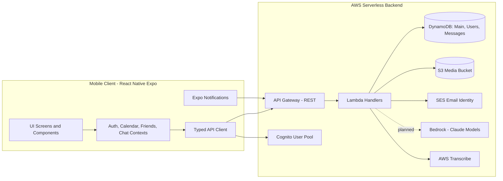
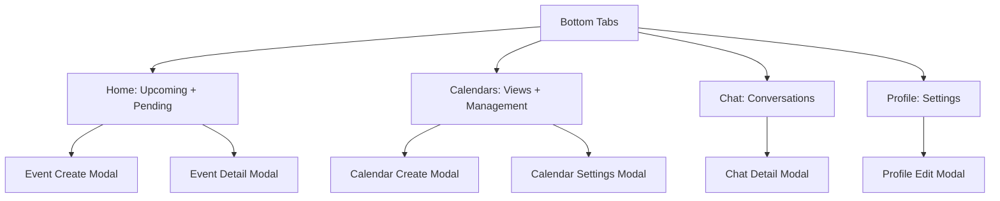

# Peachy: Intelligent Mobile Calendar with Shared Scheduling and Messaging

## Abstract
Peachy is an intelligent mobile calendar that blends natural-language scheduling, shared calendars, and in-app messaging into a single workflow. The project targets fast, low-friction scheduling while preserving privacy-aware collaboration; offline-first behavior is a planned requirement but not yet implemented. The system combines a React Native (Expo) client with a serverless AWS backend (Lambda, API Gateway, DynamoDB, Cognito, S3, SES) and a hybrid AI pipeline that uses LLM tool-calling for simple intents and a deterministic orchestrator for complex requests. The current implementation includes full mobile UI flows, a typed API client, Cognito-based auth with secure token storage, push notification registration, and a CDK-defined backend with calendar, event, chat, pending-invite, friends, RL-preferences, and transcription endpoints. This report summarizes the problem, related work, technical design, experiments, and results, and outlines future work toward production readiness.

## 1. Introduction and Problem Statement
Scheduling today is fragmented: users plan events in a calendar app, coordinate details in chat, and handle invite negotiation in separate tools. Traditional calendars prioritize manual entry, while smart assistants often ask too many clarifying questions or fail on multi-user scheduling. Peachy addresses this by unifying calendar management, shared scheduling, and chat, with AI-supported natural-language input. The goal is to reduce time-to-schedule and support group coordination; offline performance is a planned requirement for later implementation.

## 2. Related Work (Academic and Industry)
### 2.1 Academic
- Natural language interfaces and tool use: LLMs have demonstrated strong performance on instruction following and tool-calling; these insights inform Peachy’s intent parsing and action decomposition (Brown et al., 2020; Wei et al., 2022).
- Reinforcement learning for preference modeling: classic RL formulations provide a framework for preference ranking and policy updates for time-slot selection (Sutton & Barto, 2018).
- Conversational scheduling: prior work on dialog systems and task-oriented agents motivates the follow-up question strategy and slot-filling for ambiguous inputs (Young et al., 2013).

### 2.2 Industry
- Calendar products: Google Calendar, Outlook Calendar, and Apple Calendar remain the core baseline for event CRUD and availability views.
- Scheduling assistants: Motion, Reclaim.ai, Clockwise, and Calendly demonstrate value in automatic scheduling and team coordination but often require context switching across apps.
- Messaging integration: tools like Slack and Microsoft Teams allow event sharing but not a first-class scheduling workflow.

Peachy differentiates by consolidating scheduling, chat, and shared calendars, while prioritizing mobile-first UX and a planned path to offline accessibility.

## 3. Technical Approach, Solution, and Designs
### 3.1 Product Scope
Peachy’s MVP scope centers on:
- Natural-language scheduling via text or voice.
- Shared calendars with role-based permissions (Discord-style roles).
- Integrated messaging with event cards and RSVPs.
- Planned offline-first calendar access.

### 3.2 System Architecture
**Client:** React Native (Expo SDK 54) with Expo Router, TypeScript, and a theme system. The implementation includes authenticated and unauthenticated flows, calendar views (day/week/month), event create/edit/detail modals, shared calendar management, messaging, profile and settings screens, and a persistent AI input bar. State is managed with React Context providers for auth, calendars, friends, chat, and theme. Auth uses Cognito and stores tokens securely (SecureStore on native, AsyncStorage on web). A typed API client wraps authenticated requests. Push notifications are registered through `expo-notifications`.

**Backend:** AWS Serverless, defined via CDK in TypeScript. The deployed stacks include Auth (Cognito with Google OAuth, Apple optional), Database (DynamoDB tables for main data, users, and messages), Storage (S3 media bucket with lifecycle rules), Notifications (SES email identity), AI (Bedrock invoker role), API (REST API Gateway + Lambda handlers), and Monitoring (CloudWatch dashboards + AWS Budgets). The API stack currently provisions endpoints for calendars, events, chats, chat messages, friends, users, pending items, RL preferences, AI parse, and audio transcription workflows. DynamoDB is the primary data store with GSIs for user access, calendar cleanup, and date range queries.

**Data Model (High-Level):** Users, Calendars, Events, Chats, Messages, Roles, and Subscriptions with explicit relationships. The model supports personal, shared, and organization calendars, role-based permissions, and chat links to shared calendars.

**Figure 1.** System architecture (implemented components and planned AI integration).

### 3.3 AI Scheduling Pipeline (Implemented and Planned)
Peachy uses a hybrid pipeline:
- **Simple requests:** LLM tool-calling directly invokes backend actions (create event, find availability).
- **Complex requests:** LLM outputs a structured intent. A deterministic orchestrator decomposes it into backend calls for predictability and testability.
- **Follow-up questions:** The system asks only when critical info is missing.

**Implemented pieces:**
- **RL preferences service** uses a contextual multi-armed bandit (Thompson sampling) across 168 weekly hour slots per user. Endpoints exist for preference retrieval and weight updates, with DynamoDB-backed storage.
- **Audio transcription workflow** includes presigned upload, job start, and job status endpoints backed by S3 and AWS Transcribe.
- **AI parse endpoint** is provisioned in the API stack for intent parsing integration.

**Planned pieces:**
- Full Bedrock invocation and orchestration logic.
- End-to-end NL scheduling with follow-up dialog state.

### 3.4 UI and Interaction Design
- **Navigation:** Bottom tabs for Home, Calendars, Chat, and Profile.
- **Calendar Views:** Day, week, and month grids with event cards and filters.
- **Shared Calendars:** Role-based permissions and membership management.
- **Messaging:** 1:1 and group chats with embedded event invites.

**Figure 2.** Mobile information architecture and navigation.

### 3.5 Infrastructure and DevOps
- **IaC:** AWS CDK with separate dev/prod environments.
- **Stacks:** Auth, Database, Storage, Notifications, AI, API, Monitoring. Auth includes Google OAuth and a post-confirmation trigger that writes user profile data to DynamoDB.
- **Testing:** Jest with unit and integration tests; mocked AWS SDK for infra tests.
- **CI:** GitHub Actions runs tests on push/PR and uploads coverage artifacts.

## 4. Experiments, Key Metrics, and Results
### 4.1 Frontend Test Suite
- **Total tests:** 265 across 24 suites (components, hooks, utils).
- **Focus areas:** calendar rendering, forms, UI components, and date utilities.
- **Outcome:** Consistent green test runs with coverage tracking in CI.

### 4.2 Infrastructure Test Suite
- **Coverage:** Dedicated tests for Lambda handlers and shared utilities, including RL preference endpoints and validation logic.
- **Outcome:** Passing test runs with coverage tracked in CI; test harness uses mocked AWS SDK clients.

### 4.3 Performance Targets (Design Goals)
- **Offline startup:** Near-instant calendar load using cached data (planned).
- **API latency:** < 500 ms for standard CRUD operations.
- **AI scheduling:** < 2s simple requests, < 5s complex multi-step requests.

Results to date focus on frontend completeness and infrastructure readiness. End-to-end latency benchmarks remain future work once backend deployment and AI inference are fully integrated.

## 5. Future Work and Next Steps
- **Backend implementation:** Complete Lambda handlers and integrate with the existing API spec.
- **AI pipeline:** Implement tool-calling, intent parsing, and RL-based slot ranking.
- **Offline storage:** Choose and integrate a local persistence layer (SQLite or AsyncStorage).
- **Messaging real-time:** Harden WebSocket lifecycle, reconnection, and presence.
- **Accessibility audits:** Validate WCAG 2.1 AA compliance across major flows.
- **Security hardening:** Fine-grained IAM, secrets management, and threat modeling.

## 6. Team Reflection and Course Connection (Approx. 1 Page)
This project closely aligns with course goals around end-to-end software engineering, system design, and applied ML. The team gained experience in translating a product vision into an executable architecture, balancing mobile UX with cloud scalability, and defining measurable requirements early. The separation of concerns between UI, API specification, and infrastructure strengthened modularity and enabled parallel development.

From a course perspective, Peachy exercised key concepts such as requirements engineering, architecture trade-offs, and testing discipline. The hybrid AI pipeline design reflects learned principles of system controllability and reliability: LLMs are used where they provide value (natural-language input), while deterministic orchestration maintains predictability and testability. The course emphasis on non-functional requirements influenced the focus on latency targets, accessibility, and a planned offline-first roadmap.

The team also learned the importance of infrastructure as a first-class artifact. Defining the CDK stacks early clarified operational constraints (permissions, region selection, and deployment safety) and highlighted how DevOps decisions shape application behavior. Finally, the project emphasized the interplay between product goals and engineering feasibility. Scoping the MVP and documenting future features prevented scope creep and kept development aligned with real deliverables. This experience underscored the practical value of disciplined planning, incremental validation, and strong documentation in team-based software projects.

## References
- Brown, T. B., et al. (2020). Language models are few-shot learners. *NeurIPS*. https://arxiv.org/abs/2005.14165
- Wei, J., et al. (2022). Chain-of-thought prompting elicits reasoning in large language models. *NeurIPS*. https://arxiv.org/abs/2201.11903
- Sutton, R. S., & Barto, A. G. (2018). *Reinforcement Learning: An Introduction* (2nd ed.). http://incompleteideas.net/book/the-book-2nd.html
- Young, S., et al. (2013). POMDP-based statistical spoken dialog systems: A review. *Proceedings of the IEEE*. https://ieeexplore.ieee.org/document/6592993
- Google Calendar. https://calendar.google.com
- Microsoft Outlook Calendar. https://outlook.microsoft.com
- Apple Calendar. https://support.apple.com/guide/calendar/welcome/mac
- Calendly. https://calendly.com
- Motion. https://www.usemotion.com
- Reclaim.ai. https://reclaim.ai
- Clockwise. https://www.getclockwise.com
- Expo Documentation. https://docs.expo.dev
- React Native Documentation. https://reactnative.dev
- AWS CDK Documentation. https://docs.aws.amazon.com/cdk/
- AWS Lambda Documentation. https://docs.aws.amazon.com/lambda/
- AWS DynamoDB Documentation. https://docs.aws.amazon.com/dynamodb/
- AWS API Gateway Documentation. https://docs.aws.amazon.com/apigateway/
- AWS Cognito Documentation. https://docs.aws.amazon.com/cognito/
- AWS Bedrock Documentation. https://docs.aws.amazon.com/bedrock/
